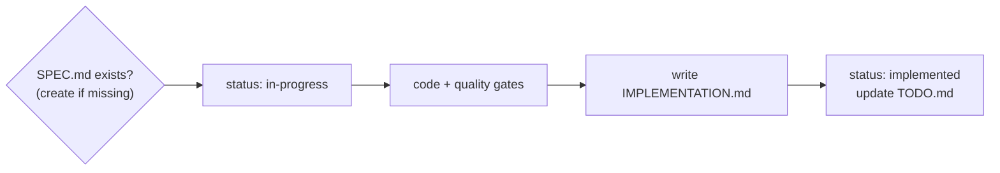

# Implement feature

Implement portfolio features with their documentation lifecycle.

## Before coding

1. Read [features/TODO.md](../../../features/TODO.md)
   and locate the feature folder.
2. **No SPEC.md exists?** Create one first via the
   [feature-spec](../feature-spec/SKILL.md) skill (create mode) — even when
   the user did not ask for a spec. Capture what you are about to build and
   why before building it.
3. Read the SPEC's desired behavior, constraints, and pending TODOs — they
   are requirements. If the requested work contradicts the SPEC, update
   the SPEC first (or ask the user when the contradiction is material).
4. Set the feature's status to `in-progress` in
   [TODO.md](../../../features/TODO.md).

## While coding

- Run the repo's quality gate (`bin/ci` — RSpec plus linters, defined by
  [app-foundation](../../../features/app-foundation/SPEC.md)) and keep it
  green before writing `IMPLEMENTATION.md`.
- Respect the publication policy in
  [curated-content](../../../features/curated-content/SPEC.md): this
  repository is public, and no change may introduce personal contact details,
  compensation figures, or any other excluded category into `data/**`, the
  rendered site, or a generated artifact.
- Scope discipline: implement what the SPEC says; park new ideas as
  "Pending TODOs" in the SPEC instead of gold-plating.

## After coding

1. Write or update `IMPLEMENTATION.md` in the feature folder (template in
   the [feature-spec](../feature-spec/SKILL.md) skill): entry points, key
   files, configuration, testing, known pitfalls, and the commit SHA the
   doc was written against. Link referenced files with markdown links and
   add a mermaid flow diagram when the runtime flow is non-trivial.
   **`IMPLEMENTATION.md` must be written before the commit** — the commit
   SHA in the frontmatter is the commit the doc describes, so write the doc
   against the working tree, then commit both code and doc together.
2. Update `SPEC.md`: bump `Updated:` in both frontmatter and body header,
   check off completed pending TODOs, set `status` to `implemented` in
   both frontmatter and body header.
3. Update the feature's row in
   [TODO.md](../../../features/TODO.md): set status
   to `implemented`, fill the **Implemented** column with the date from
   `IMPLEMENTATION.md`, move the row to the implemented group (top of the
   table). Remove any of its items from the "Pending work" section that are
   now complete; keep follow-up items that remain open.

## Bug fixes and behavior changes

Any change that alters a feature's observable behavior, constraints, or
file layout must update the affected `SPEC.md` and/or `IMPLEMENTATION.md`
in the same session — docs that lag the code are worse than no docs.
Pure internal refactors with no behavior change only need an
`IMPLEMENTATION.md` touch when key files moved.

## Related skills

- [feature-spec](../feature-spec/SKILL.md) — templates and backlog
  conventions used by this workflow.
