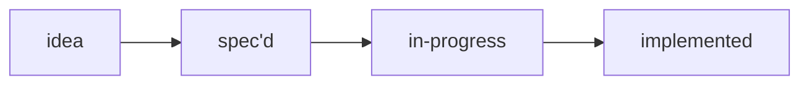
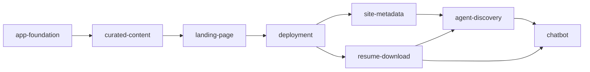

# Portfolio feature backlog

Status index for this Rails 8 + Hotwire professional showcase site. One folder
per feature, each with a `SPEC.md` (what and why) and, once implemented, an
`IMPLEMENTATION.md` (how). This file is the single cheap read that answers
"what does the site do, what is pending, and what are the constraints".

Maintained by the [feature-spec](../.opencode/skills/feature-spec/SKILL.md) and
[implement-feature](../.opencode/skills/implement-feature/SKILL.md) skills. Keep
this table in sync whenever a feature folder is added or a status changes.

The `commit` field in each `IMPLEMENTATION.md` names the commit the feature
landed in — the one carrying both its code and that document — not the commit
before it, while `updated` tracks the document's own last revision.

## Blocking preconditions

Not features. Preconditions that gate the first commit.

- **The repository is public.** Everything committed is permanent and
  world-readable, including `data/**` and this backlog.
- **`data/` contains only reviewed, publication-safe records.** The unreviewed
  seed resume that carried a direct phone number and personal email was deleted
  before any commit existed, so those values were never written to history.
- **`.gitignore` is in place**, covering agent session artifacts, secrets, and
  Rails runtime paths. Vendored `node_modules` was already excluded by
  `.opencode/.gitignore`.

Commit #1 is unblocked.

## Ordering

The sequence is dependency-driven, not priority-driven:

`deployment` sits early on purpose: `site-metadata` and `resume-download` both
need a real canonical origin, and shipping continuously beats a big-bang
release. `agent-discovery` follows `site-metadata` because it reuses the origin,
the canonical URL helpers, and the `Person` entity, and because it publishes
absolute URLs. `chatbot` is last by explicit request and because it is the only
feature that adds an external dependency, a running cost, and an abuse surface.

## Features

| Feature | Status | Created | Implemented | Summary |
| ------- | ------ | ------- | ----------- | ------- |
| [app-foundation](app-foundation/SPEC.md) | implemented | 2026-08-06 | 2026-10-03 | Rails 8 + Hotwire app that boots with no database, no Node toolchain, and no Solid adapters; the shared `rails-quality-assurance` kit (RuboCop, Reek, Flay, Brakeman, bundler-audit) and RSpec behind one `CI.run` entry point, with SimpleCov enforcing 100% line and branch coverage |
| [curated-content](curated-content/SPEC.md) | implemented | 2026-08-06 | 2026-08-06 | Bilingual Markdown content in `data/**` with an enforced front-matter schema, a publication allowlist, and a content-safety scanner that fails the build |
| [landing-page](landing-page/SPEC.md) | implemented | 2026-08-06 | 2026-08-06 | One server-rendered locale-aware page at `/` and `/pt-BR`, built entirely from the content records; zero JavaScript, zero web fonts, 18.5 KB gzipped, design language recorded in [DESIGN.md](../DESIGN.md) |
| [site-metadata](site-metadata/SPEC.md) | implemented | 2026-08-06 | 2026-08-06 | Canonical URLs, hreflang, OG/Twitter cards, `Person` JSON-LD asserted to carry no contact field, an app-served sitemap dated from record `updated` values, a robots policy that allows AI crawlers on purpose, and a share card and favicon built from `site_profile` by `bin/rails site:images` |
| [agent-discovery](agent-discovery/SPEC.md) | implemented | 2026-10-03 | 2026-10-03 | The surfaces an AI agent looks for: `llms.txt`, `/.well-known` discovery documents (ARD, agent skills, MCP server card, A2A card, RFC 9727, RFC 9728), an OpenAPI 3.1 description, a read-only JSON API, a stateless MCP server over Streamable HTTP, Markdown twins, Link headers, richer JSON-LD, and `/about`, `/contact` and `/privacy` |
| [resume-download](resume-download/SPEC.md) | implemented | 2026-08-06 | 2026-10-05 | Add the concise two-page English resume as the primary download; retain the record-derived complete profile per locale, with extracted-text and metadata safety guards |
| [deployment](deployment/SPEC.md) | in-progress | 2026-08-06 | — | Live over HTTPS at `mauricio.zaffari.casa` from one stateless container on the house host, built where it runs and swapped by `bin/deploy` behind a health check. Security headers and the full CI gate are in place. The one unmet criterion is the rollback exercise, which is why this stays in-progress |
| [chatbot](chatbot/SPEC.md) | spec'd | 2026-08-06 | — | Flag-gated grounded assistant over the published corpus only, with citations, explicit refusals, adversarial specs, rate limits, and no vector database |

## Publication policy

The one rule that cuts across every feature, per the owner's decision:

- **Permitted**: hard performance numbers, contribution metrics, named clients
  and employers, open-source download counts, public media coverage.
- **Never published**: personal compensation in any form — pay rate, salary,
  day rate, share counts, equity value, option grants.
- **Never published**: legal identifiers, addresses, immigration material,
  family, medical and financial data, credentials, internal URLs, and any
  direct contact field outside the approved professional-profile allowlist.

Details and enforcement live in
[curated-content](curated-content/SPEC.md).

## Pending work

Concrete pending TODOs live in each feature's `SPEC.md` under "Pending TODOs".
Listed here in the order they block progress:

- [Deployment](deployment/SPEC.md): **in progress.** The site is live at
  `https://mauricio.zaffari.casa`, served by a Docker container on the house
  host and deployed by [`bin/deploy`](../bin/deploy) — see
  [its IMPLEMENTATION.md](deployment/IMPLEMENTATION.md) for the topology and the
  runbook. What is left is to **exercise the rollback** on purpose, which this
  SPEC requires; decide the deploy trigger; and decide what the apex
  `zaffari.casa` does. The Kamal configuration is complete and unused: it is the
  only route to a host that is not on the LAN.
- [Curated content](curated-content/SPEC.md): **nothing pending.** Both locales
  are authored and published — 72 records, 36 in `en` and 36 in `pt-BR`. The
  fallback still covers the case of an English record authored ahead of its
  translation, and is now proven by fixtures rather than by the corpus happening
  to be incomplete.
- [Landing page](landing-page/SPEC.md): decide whether `source_url` becomes a
  visible citation, and whether `metric` and `skill_group` get an ordering key.
  Neither blocks anything; both are recorded so they are not improvised.
- [Site metadata](site-metadata/SPEC.md): **implemented** — both open decisions
  are made and recorded (AI crawlers allowed on purpose; the share card is a
  static PNG built from the record by `bin/rails site:images`). What is left
  needs the live origin: validate the unfurl through LinkedIn's and Slack's own
  debuggers, which cannot reach a local server. A second open item is whether a
  share card left stale by a profile edit should fail the build; CI cannot run
  the image task, so nothing detects it today.
- [Resume download](resume-download/SPEC.md): **implemented** — see
  [its IMPLEMENTATION.md](resume-download/IMPLEMENTATION.md). Two open items,
  neither blocking: whether a one-page variant is worth having (the honest build
  is a key on the records, not a selection rule inside the feature), and the
  untagged-PDF accessibility gap Prawn leaves, whose mitigation today is that
  drawing order is reading order and the colophon links back to the HTML page.
- [Agent discovery](agent-discovery/SPEC.md): **implemented** — see
  [its IMPLEMENTATION.md](agent-discovery/IMPLEMENTATION.md). The canonical
  origin is `https://mauricio.zaffari.casa`, the host that actually serves the
  site. The remaining item is the apex `zaffari.casa`, which currently answers
  with a different application: repointing it or 301-ing it to the canonical
  host is a DNS and deployment decision. A `/pricing.md` was deliberately not
  added, because the publication policy forbids compensation.
- [Chatbot](chatbot/SPEC.md): decide conversation logging and retention, and
  record the corpus-size threshold that would justify a vector database.
  Provider (Gemini) and the USD 20/month hard cap are decided.
- [App foundation](app-foundation/SPEC.md): drop the `nodejs` pin from
  `.tool-versions`. Nothing in the build reads it — there is no `package.json`
  and Tailwind runs from the binary the `tailwindcss-ruby` gem vendors — so the
  pin only suggests a toolchain the project has ruled out. Blocks nothing.
