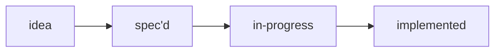
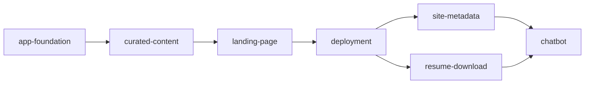

# Portfolio feature backlog

Status index for this Rails 8 + Hotwire professional showcase site. One folder
per feature, each with a `SPEC.md` (what and why) and, once implemented, an
`IMPLEMENTATION.md` (how). This file is the single cheap read that answers
"what does the site do, what is pending, and what are the constraints".

Maintained by the [feature-spec](../.opencode/skills/feature-spec/SKILL.md) and
[implement-feature](../.opencode/skills/implement-feature/SKILL.md) skills. Keep
this table in sync whenever a feature folder is added or a status changes.

## Blocking preconditions

Not features. Preconditions that gate the first commit.

- **The repository is public.** Everything committed is permanent and
  world-readable, including `data/**` and this backlog.
- **`data/` contains only reviewed, publication-safe records.** The unreviewed
  seed resume that carried a direct phone number and personal email was deleted
  before any commit existed, so those values were never written to history.
- **`.gitignore` is in place**, covering agent session artifacts, secrets, and
  Rails runtime paths. Vendored `node_modules` was already excluded by
  `.opencode/.gitignore`.

Commit #1 is unblocked.

## Ordering

The sequence is dependency-driven, not priority-driven:

`deployment` sits early on purpose: `site-metadata` and `resume-download` both
need a real canonical origin, and shipping continuously beats a big-bang
release. `chatbot` is last by explicit request and because it is the only
feature that adds an external dependency, a running cost, and an abuse surface.

## Features

| Feature | Status | Created | Implemented | Summary |
| ------- | ------ | ------- | ----------- | ------- |
| [app-foundation](app-foundation/SPEC.md) | spec'd | 2026-08-06 | — | Rails 8 + Hotwire app that boots with no database, no Node toolchain, and no Solid adapters; RSpec and linters behind one CI entry point |
| [curated-content](curated-content/SPEC.md) | in-progress | 2026-08-06 | — | Bilingual Markdown content in `data/**` with an enforced front-matter schema, a publication allowlist, and a content-safety scanner that fails the build |
| [landing-page](landing-page/SPEC.md) | spec'd | 2026-08-06 | — | One server-rendered locale-aware page with a recorded design direction; accessibility and performance as acceptance criteria, not a later phase |
| [deployment](deployment/SPEC.md) | spec'd | 2026-08-06 | — | HTTPS at the canonical origin from a single stateless container, security headers, and CI that blocks deploy on a failing content scan |
| [site-metadata](site-metadata/SPEC.md) | spec'd | 2026-08-06 | — | Canonical URLs, hreflang, OG/Twitter cards, `Person` JSON-LD, sitemap, and a deliberate AI-crawler policy — all derived from `site_profile` |
| [resume-download](resume-download/SPEC.md) | spec'd | 2026-08-06 | — | Publication-safe resume generated from the same records as the page, with no phone, email, address, or compensation in content or PDF metadata |
| [chatbot](chatbot/SPEC.md) | spec'd | 2026-08-06 | — | Flag-gated grounded assistant over the published corpus only, with citations, explicit refusals, adversarial specs, rate limits, and no vector database |

## Publication policy

The one rule that cuts across every feature, per the owner's decision:

- **Permitted**: hard performance numbers, contribution metrics, named clients
  and employers, open-source download counts, public media coverage.
- **Never published**: personal compensation in any form — pay rate, salary,
  day rate, share counts, equity value, option grants.
- **Never published**: legal identifiers, addresses, immigration material,
  family, medical and financial data, credentials, internal URLs, and any
  direct contact field outside the approved professional-profile allowlist.

Details and enforcement live in
[curated-content](curated-content/SPEC.md).

## Pending work

Concrete pending TODOs live in each feature's `SPEC.md` under "Pending TODOs".
Listed here in the order they block progress:

- [Curated content](curated-content/SPEC.md): build the enforcement half — the
  loader, the content-safety scanner, and the outside-app-root grep gate. Until
  they exist the publication policy rests on human review alone, which is
  weaker than the SPEC intends. Blocked on the Rails app.
- [App foundation](app-foundation/SPEC.md): decide the linter set and pin the
  Tailwind standalone binary. **Next feature up** — it unblocks the enforcement
  half above.
- [Curated content](curated-content/SPEC.md): author the `pt-BR` records.
- [Landing page](landing-page/SPEC.md): write the `## Design direction` values
  into the spec before any UI code; decide the locale URL strategy, which
  constrains hreflang.
- [Deployment](deployment/SPEC.md): choose the host and deploy mechanism;
  decide the deploy trigger. Canonical origin is recorded: `https://zaffari.casa`.
- [Site metadata](site-metadata/SPEC.md): decide the AI/LLM crawler policy and
  whether the share image is static or generated.
- [Resume download](resume-download/SPEC.md): choose the generation approach
  given the stateless container; decide whether the PDF shares the page's
  design direction.
- [Chatbot](chatbot/SPEC.md): choose the provider and cost ceiling; decide
  conversation logging and retention; record the corpus-size threshold that
  would justify a vector database; decide the UI surface.
