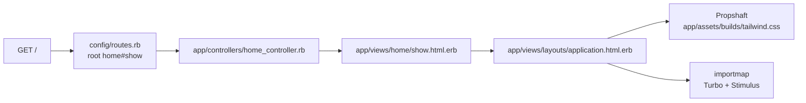

# App Foundation — implementation

- Updated: 2026-10-03
- Code as of: repository commit `e35b4a7`, the commit this feature landed in and
  the first to contain application code. The quality-assurance kit and the
  coverage gate were added later; that commit is named in the front matter.
- Spec: [SPEC.md](SPEC.md)

## Entry points / flow



`GET /` is the placeholder root. `GET /up` is the Rails health check, which
returns 200 whenever the app boots — useful to a load balancer once
[deployment](../deployment/SPEC.md) lands.

## How the app was generated

Rails 8.1.3.1, generated outside this repository and copied in, so that the
existing `.gitignore` was never clobbered by the generator:

```sh
rails new portfolio \
  --skip-active-record --skip-active-job --skip-active-storage \
  --skip-action-mailer --skip-action-mailbox --skip-action-text \
  --skip-action-cable --skip-solid --skip-jbuilder \
  --skip-test --skip-system-test \
  --skip-docker --skip-kamal --skip-thruster --skip-ci \
  --skip-brakeman --skip-bundler-audit \
  --javascript importmap --css tailwind
```

`.gitignore` was not copied; the repository's own file already covered every
Rails runtime path except `app/assets/builds/`, which it now excludes too.
`README.md` and
`.ruby-version` were also not copied — the former was boilerplate, the latter
would duplicate the version pin that `.tool-versions` already owns.

## Key files

| Path | Role |
|---|---|
| `config/application.rb` | Loads only `active_model`, `action_controller`, and `action_view` railties. The excluded frameworks are documented in place. |
| `Gemfile` | No database adapter, no Solid gems, no jbuilder. Pins `tailwindcss-rails` and `tailwindcss-ruby`. |
| `config/routes.rb` | `root "home#show"` plus the `/up` health check. |
| `app/controllers/home_controller.rb` | Placeholder root action. Owned by [landing-page](../landing-page/SPEC.md) from here on. |
| `app/views/home/show.html.erb` | Placeholder markup. Exists to prove Tailwind classes compile. |
| `app/assets/tailwind/application.css` | Tailwind entry point; compiled to `app/assets/builds/tailwind.css`. |
| `config/importmap.rb` | Pins Turbo and Stimulus. No bundler, no `package.json`. |
| `bin/ci` + `config/ci.rb` | The single quality gate, run through the kit's `CI.run do ... end` harness. |
| `.rubocop.yml` | Inherits `rails-quality-assurance`'s `rubocop.yml`. No local exclusions. |
| `.simplecov` | `cover_views`, so rendered templates count toward coverage. |
| `spec/spec_helper.rb` | One line: `require 'rails_quality_assurance/all'`. |
| `spec/rails_helper.rb` | `require 'rails_quality_assurance/rails_helper'` plus `config.use_active_record = false`. |
| `.githooks/pre-commit` | Installed by the kit's pre-commit generator; RuboCop, Reek, and RSpec before a commit. |

## Configuration

No environment variables are required to boot in development or test.
`config/master.key` is generated locally and is gitignored; production reads
`SECRET_KEY_BASE` or the master key, which [deployment](../deployment/SPEC.md)
will supply.

There is no `config/database.yml` and there must never be one.

## Decisions

**Linter set** (resolves the SPEC's first pending TODO):

- **RuboCop with the shared `rails-quality-assurance` ruleset**, inherited
  through `inherit_gem` in `.rubocop.yml`. `rubocop-rails-omakase` was removed
  when the kit arrived; the kit's baseline is the Develoz house style and is
  what every other project uses. `.rubocop.yml` carries file-type exclusions
  only (generated ERB, `vendor/`), never a `rubocop:disable`, and every
  finding is fixed at the source.
- **Reek, Flay, and Brakeman** run from the kit's `qa:*` rake tasks. Reek uses
  the kit's default `config/reek.yml` (there is deliberately no local
  `.reek.yml`); its strict defaults — one repeated call per method, three
  parameters, five constants, four instance variables — shaped several of the
  refactors below rather than being turned off. Flay's threshold is the task
  default and the app scores zero. Brakeman reports no warnings.
- **Bundler-audit** stays the plain `check` without `--update`, for the reason
  recorded in the `Gemfile`.
- **ERB/HTML checked by `herb analyze`**, not `herb lint`. `herb lint` shells
  out to `npx @herb-tools/linter`, which would introduce a Node toolchain and
  violate a hard rule in [AGENTS.md](../../AGENTS.md). `herb analyze` runs on
  the gem's native C extension with Prism, catches ERB parse failures and
  malformed or unclosed HTML, and exits non-zero on findings. The tradeoff is
  no HTML *style* rules; the structural errors it does catch are the ones that
  actually break a server-rendered page.
- **`erb_lint` was evaluated and rejected.** It works, but it depends on the
  `parser` gem, which on Ruby 4.0.6 falls back to a 3.3 grammar and prints a
  compatibility warning on every run. Herb parses with Prism and has no such
  drift.
- **No Markdown linter for `data/**`.** Those records are prose with
  front matter, and their real risk is disclosure, not formatting. The
  front-matter schema and the content-safety scanner specified by
  [curated-content](../curated-content/SPEC.md) are the right gate, and they
  belong to that feature.
- **`rubocop-rspec` arrives with the kit**, so specs are linted too.

**Coverage gate** (resolves the SPEC's second pending TODO): the kit's single
`require 'rails_quality_assurance/all'` at the top of `spec/spec_helper.rb`
starts SimpleCov before application code loads, and the gem defaults
`minimum_coverage` to 100% line and branch. `.simplecov` adds `cover_views`, so
the ERB templates are measured alongside the Ruby. The suite is at 100% line
and 100% branch with no `nocov` comments and no relaxed threshold; the refactors
that made the strict Reek and RuboCop rules pass also removed most defensive
branches, and the remainder — a case study with no technologies, a profile with
no paragraph, a sitemap with no readable date — are covered by fixtures or
direct unit specs.

**Tailwind pinning** (resolves the SPEC's second pending TODO): `tailwindcss-rails`
4.x no longer downloads a binary at install time — it depends on
`tailwindcss-ruby`, whose version *is* the Tailwind CLI version and which ships
the standalone binary as a platform-specific gem. Both are pinned in the
`Gemfile` and locked in `Gemfile.lock` (`tailwindcss-ruby 4.3.3`, Tailwind CLI
v4.3.3), so the CLI version is reproducible from the lockfile alone. `bin/tailwindcss`
does not exist and is not needed; `.gitignore` already excludes it harmlessly.

**Active Job was skipped** even though the SPEC does not name it. Nothing
enqueues anything, there is no queue backend, and leaving it out keeps the
boot surface honest. Turbo works without it because nothing broadcasts.

**Brakeman, bundler-audit, Kamal, Docker, and the GitHub Actions workflow were
skipped.** Security scanning and CI hosting belong to
[deployment](../deployment/SPEC.md), which is where they will be chosen
deliberately rather than inherited.

## Testing

- Run the whole gate with `bin/ci`. Its steps, in order: `bin/setup
  --skip-server`, `bin/rubocop`, `bin/rails qa:reek`, `bin/rails qa:flay`,
  `bin/herb analyze app/views`, `content:validate`, `content:scan`,
  `content:paths`, `bin/importmap audit`, `bin/bundle-audit check`, `bin/rails
  qa:brakeman`, then `bin/rspec`. There is no biome, stylelint, markdownlint,
  yamllint, or npm-audit step: this app has no `package.json` and no Node.
- The suite alone is `bin/rspec`; SimpleCov fails the run if line or branch
  coverage drops below 100%.
- A pre-commit hook (`.githooks/pre-commit`, installed by the kit) runs
  RuboCop, Reek, and RSpec on staged Ruby and spec files. No `core.hooksPath`
  is set.

## Known limitations / pitfalls

- **Active Record and friends are still in `Gemfile.lock`.** They arrive as
  dependencies of the `rails` metagem. They are never required, so they are
  never loaded — verified at runtime — but do not read their presence in the
  lockfile as permission to use them.
- **`bin/importmap audit` needs network access.** It is a Rails 8.1 default
  step in `config/ci.rb` and will fail a fully offline CI run.
- **Do not add `config/database.yml`, a database adapter, or a Solid gem.**
  Every one of them is excluded by [AGENTS.md](../../AGENTS.md) hard rule 5,
  and the deployment topology depends on their absence.
- **Do not run `rails new` again inside this repository.** It will overwrite
  `.gitignore`.
- **The root route is a placeholder.** `home#show` and its view exist to prove
  the stack works. [landing-page](../landing-page/SPEC.md) owns what replaces
  them; do not grow them incrementally into a real page.
