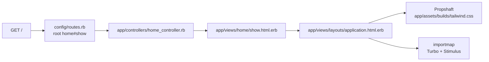

# App Foundation — implementation

- Updated: 2026-08-08
- Code as of: repository commit `e35b4a7`, the commit this feature landed in and
  the first to contain application code
- Spec: [SPEC.md](SPEC.md)

## Entry points / flow



`GET /` is the placeholder root. `GET /up` is the Rails health check, which
returns 200 whenever the app boots — useful to a load balancer once
[deployment](../deployment/SPEC.md) lands.

## How the app was generated

Rails 8.1.3.1, generated outside this repository and copied in, so that the
existing `.gitignore` was never clobbered by the generator:

```sh
rails new portfolio \
  --skip-active-record --skip-active-job --skip-active-storage \
  --skip-action-mailer --skip-action-mailbox --skip-action-text \
  --skip-action-cable --skip-solid --skip-jbuilder \
  --skip-test --skip-system-test \
  --skip-docker --skip-kamal --skip-thruster --skip-ci \
  --skip-brakeman --skip-bundler-audit \
  --javascript importmap --css tailwind
```

`.gitignore` was not copied; the repository's own file already covered every
Rails runtime path except `app/assets/builds/`, which it now excludes too.
`README.md` and
`.ruby-version` were also not copied — the former was boilerplate, the latter
would duplicate the version pin that `.tool-versions` already owns.

## Key files

| Path | Role |
|---|---|
| `config/application.rb` | Loads only `active_model`, `action_controller`, and `action_view` railties. The excluded frameworks are documented in place. |
| `Gemfile` | No database adapter, no Solid gems, no jbuilder. Pins `tailwindcss-rails` and `tailwindcss-ruby`. |
| `config/routes.rb` | `root "home#show"` plus the `/up` health check. |
| `app/controllers/home_controller.rb` | Placeholder root action. Owned by [landing-page](../landing-page/SPEC.md) from here on. |
| `app/views/home/show.html.erb` | Placeholder markup. Exists to prove Tailwind classes compile. |
| `app/assets/tailwind/application.css` | Tailwind entry point; compiled to `app/assets/builds/tailwind.css`. |
| `config/importmap.rb` | Pins Turbo and Stimulus. No bundler, no `package.json`. |
| `bin/ci` + `config/ci.rb` | The single quality gate. |
| `.rubocop.yml` | Inherits `rubocop-rails-omakase`. |
| `spec/rails_helper.rb` | `config.use_active_record = false`. |
| `spec/requests/home_spec.rb` | Asserts `GET /` returns 200. |

## Configuration

No environment variables are required to boot in development or test.
`config/master.key` is generated locally and is gitignored; production reads
`SECRET_KEY_BASE` or the master key, which [deployment](../deployment/SPEC.md)
will supply.

There is no `config/database.yml` and there must never be one.

## Decisions

**Linter set** (resolves the SPEC's first pending TODO):

- **RuboCop with `rubocop-rails-omakase`**, unmodified. It is the Rails 8
  default, it is the ruleset the framework's own generated code already
  satisfies, and it is deliberately permissive about formatting so review
  attention goes to design rather than style. `.rubocop.yml` carries no
  overrides and no `rubocop:disable` comments exist anywhere in the app. A
  stricter ruleset would have meant hand-editing generated files on day one to
  satisfy rules nobody had chosen.
- **ERB/HTML checked by `herb analyze`**, not `herb lint`. `herb lint` shells
  out to `npx @herb-tools/linter`, which would introduce a Node toolchain and
  violate a hard rule in [AGENTS.md](../../AGENTS.md). `herb analyze` runs on
  the gem's native C extension with Prism, catches ERB parse failures and
  malformed or unclosed HTML, and exits non-zero on findings. The tradeoff is
  no HTML *style* rules; the structural errors it does catch are the ones that
  actually break a server-rendered page.
- **`erb_lint` was evaluated and rejected.** It works, but it depends on the
  `parser` gem, which on Ruby 4.0.6 falls back to a 3.3 grammar and prints a
  compatibility warning on every run. Herb parses with Prism and has no such
  drift.
- **No Markdown linter for `data/**`.** Those records are prose with
  front matter, and their real risk is disclosure, not formatting. The
  front-matter schema and the content-safety scanner specified by
  [curated-content](../curated-content/SPEC.md) are the right gate, and they
  belong to that feature.
- **No `rubocop-rspec`.** One spec file does not justify a second ruleset.

**Tailwind pinning** (resolves the SPEC's second pending TODO): `tailwindcss-rails`
4.x no longer downloads a binary at install time — it depends on
`tailwindcss-ruby`, whose version *is* the Tailwind CLI version and which ships
the standalone binary as a platform-specific gem. Both are pinned in the
`Gemfile` and locked in `Gemfile.lock` (`tailwindcss-ruby 4.3.3`, Tailwind CLI
v4.3.3), so the CLI version is reproducible from the lockfile alone. `bin/tailwindcss`
does not exist and is not needed; `.gitignore` already excludes it harmlessly.

**Active Job was skipped** even though the SPEC does not name it. Nothing
enqueues anything, there is no queue backend, and leaving it out keeps the
boot surface honest. Turbo works without it because nothing broadcasts.

**Brakeman, bundler-audit, Kamal, Docker, and the GitHub Actions workflow were
skipped.** Security scanning and CI hosting belong to
[deployment](../deployment/SPEC.md), which is where they will be chosen
deliberately rather than inherited.

## Testing

- `spec/requests/home_spec.rb` — `GET /` returns 200. This is also the boot
  test: it fails if any railtie removal broke the app.
- Run everything with `bin/ci`, or the suite alone with `bin/rspec`.

## Known limitations / pitfalls

- **Active Record and friends are still in `Gemfile.lock`.** They arrive as
  dependencies of the `rails` metagem. They are never required, so they are
  never loaded — verified at runtime — but do not read their presence in the
  lockfile as permission to use them.
- **`bin/importmap audit` needs network access.** It is a Rails 8.1 default
  step in `config/ci.rb` and will fail a fully offline CI run.
- **Do not add `config/database.yml`, a database adapter, or a Solid gem.**
  Every one of them is excluded by [AGENTS.md](../../AGENTS.md) hard rule 5,
  and the deployment topology depends on their absence.
- **Do not run `rails new` again inside this repository.** It will overwrite
  `.gitignore`.
- **The root route is a placeholder.** `home#show` and its view exist to prove
  the stack works. [landing-page](../landing-page/SPEC.md) owns what replaces
  them; do not grow them incrementally into a real page.
