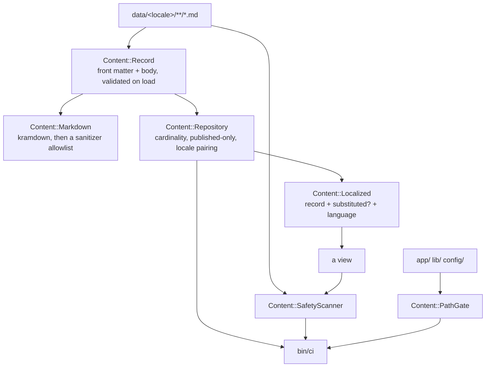

# Curated Content — implementation

- Updated: 2026-08-08
- Code as of: repository commit `539541b`, the commit this feature landed in
- Spec: [SPEC.md](SPEC.md)

This is the enforcement half of the feature. The records themselves landed
separately — the 34 English ones in `e661f2f`, the 34 Portuguese ones in
`dfdab9f` and `589ec86`, 68 in all. What lands here is the loader that refuses
an invalid one, the scanner that fails the build on content that must never be
published, and the gate that proves the application never reaches outside its
own root.

## Entry points / flow

A view reaches content through `Content.repository`, which is memoized in
production and rebuilt per call in development so that editing a Markdown file
shows up without restarting the server. Every locale-aware query is built on
`Repository#renderable`, so a `draft` or `restricted` record has no route to a
page at all — the filter lives in the loader rather than in a controller or a
view, where it could be forgotten once.

Nothing renders content yet: at this commit the root route is still the
placeholder that [landing-page](../landing-page/SPEC.md) owns.

## Key files

| Path | Role |
|---|---|
| `app/models/content.rb` | Namespace, the `InvalidRecord` error, `Content.root`, and the memoize-or-reload decision behind `Content.repository`. |
| `app/models/content/schema.rb` | The SPEC's type vocabulary as data: required keys, body policy, cardinality, and the locale/status/confidentiality/prominence enumerations. |
| `app/models/content/record.rb` | One file: front matter plus body, with every validation the SPEC names. Raises `InvalidRecord` naming the file and the key. |
| `app/models/content/repository.rb` | Loads and validates the tree as a set, enforces per-locale cardinality, and exposes the published-only, locale-aware queries. |
| `app/models/content/localized.rb` | A record chosen for a requested locale, plus `substituted?` and `language` for the `lang` attribute. |
| `app/models/content/markdown.rb` | kramdown render followed by `Rails::HTML5::SafeListSanitizer` against a prose-only allowlist. |
| `app/models/content/safety_scanner.rb` | The 22 publication rules, run over both `data/**` and rendered HTML. |
| `app/models/content/path_gate.rb` | Asserts no file under `app/`, `lib/` or `config/` names a filesystem path outside the application root. |
| `app/models/content/finding.rb` | Where a gate fired and why. Carries no excerpt, deliberately. |
| `lib/tasks/content.rake` | `content:validate`, `content:scan` and `content:paths`, each aborting with a readable message. |
| `config/ci.rb` | Wires those three tasks into `bin/ci` between the style steps and the importmap audit. |
| `spec/fixtures/unsafe-record.md` | Synthetic record that trips every scanner rule. Never under `data/`. |
| `spec/support/content_tree.rb` | Builds throwaway content trees so specs never write to `data/`. |

## Configuration

None. No environment variables, no initializer, no new runtime dependency
beyond the `kramdown` gem. The content root is `Rails.root.join("data")` and is
not configurable, because a configurable content root is the first step toward
one that points at the operator's private source material.

## Decisions

**kramdown, not commonmarker.** kramdown is pure Ruby, so it adds no native
extension and no platform-specific rows to `Gemfile.lock`. commonmarker was the
alternative and is safer by default — it refuses raw HTML outright — but it
ships as a Rust extension whose published platforms do not cover every row
already in this lockfile, which would mean compiling from source on some
targets. The tradeoff is acceptable because the renderer was never the security
control: the sanitizer is. kramdown passes raw HTML through verbatim, and
`Content::Markdown` then strips everything outside a prose-only allowlist. A
`<script>` tag loses its tag (Rails leaves the inert text behind, which is
documented sanitizer behaviour) and a `javascript:` href loses its attribute.
Both are proved in `spec/models/content/markdown_spec.rb`.

**Heading ids are off.** Four case studies each open with `## Problem`. A page
composing them with `auto_ids` on would emit duplicate ids, so they are disabled
at the renderer and `id` is absent from the sanitizer's attribute allowlist.
Do not add it to either.

**The bearer-token rule matches a token, not the English word.** This is the one
place where the literal wording of the rule list and the existing content
collide. `data/en/case_studies/cognito-auth-migration.md` legitimately discusses
"bearer-token verification" and "token handling" — it is a case study about
migrating to managed authentication. Matching the bare word `bearer` would fail
the build on a record that discloses nothing, and a gate that cries wolf gets
switched off. The rule therefore matches the shape of a credential —
`bearer` followed by whitespace and sixteen or more token characters — plus JWT
and PEM shapes as separate rules. `api_key`, `secret_key` and `password` are
matched as bare words, because no record contains them and a record that starts
to is worth a human look. This is recorded as a conflict rather than buried:
the rule was narrowed to what it is actually for, not deleted.

**Propshaft digests are normalized out of the HTML scan.** Propshaft
fingerprints every asset URL with the first eight hex characters of a SHA1.
Roughly one digest in forty comes out as eight digits, which would trip the
unpunctuated-document-number rule on a page holding no personal data at all — a
flaky gate, which is worse than none. `SafetyScanner#scan_html` drops the digest
and leaves every other byte alone. A document number in the page's own text
still fires, and there is a spec for that.

**Findings carry no excerpt.** CI output for a public repository is itself a
published surface. Printing the matched value would disclose exactly what the
gate had just caught. A file and a line number are enough to find it locally.

**`data/` holds Markdown and nothing else.** The loader raises on any other file
extension. A PDF or a spreadsheet dropped in here is the raw copy this whole
feature exists to prevent, and the glob would otherwise walk straight past it.

**Three CI steps, not one.** `content:validate`, `content:scan` and
`content:paths` fail with different meanings and different fixes, so they are
named separately in `bin/ci` output. Each is also a spec, because the CI step
proves the real tree is clean while the spec proves the detector works at all.

**`path_gate.rb` skips itself.** It necessarily spells out the literals it
searches for. The skip is an explicit entry in `PathGate::SKIPPED`, and a spec
asserts both that the file would match and that it is skipped, so the exclusion
cannot quietly outlive its reason.

## Testing

| Spec | What it proves |
|---|---|
| `spec/models/content/record_spec.rb` | Every rejection the SPEC names, one example each: missing keys, unknown type, id/filename mismatch, non-kebab id, every enumeration, locale/directory disagreement, a record outside a locale directory, `summary` in front matter, a body where the type forbids one and none where it requires one, and `published` + `restricted`. |
| `spec/models/content/repository_spec.rb` | The real `data/` tree loads; a non-Markdown file is rejected; cardinality per locale; a draft and a restricted record are unreachable from every query; locale fallback pairs by id and reports the substitution; `Content.repository` memoizes when reloading is off and picks up an edit when it is on. |
| `spec/models/content/markdown_spec.rb` | The constructs the corpus uses render, and a script tag, a `javascript:` URL, an event handler and an iframe all fail to survive. |
| `spec/models/content/safety_scanner_spec.rb` | Every declared rule fires against the unsafe fixture — the assertion is set equality, so adding a rule without a fixture case fails the suite. Also: all 68 real records are clean, the allowlisted address passes while any other address fails, and figures, currency and authentication prose are not false positives. |
| `spec/models/content/path_gate_spec.rb` | This application is clean; a home path, a tilde path and a mounted volume each fire; a URL that merely contains `/home/` does not; and nothing outside `app/`, `lib/` and `config/` is read. |
| `spec/requests/rendered_html_safety_spec.rb` | Every static GET route in the routing table renders HTML with no findings. Driven by the routing table, so a page a later feature adds is covered without editing the spec. |

Both directions were verified by hand: with an invalid record, an unsafe value,
or an outside-root path in place, `bin/ci` exits 1 and names the file and line;
with them removed it exits 0.

## Known limitations / pitfalls

- **Routes with a required dynamic segment are not scanned.** There is no honest
  way to invent a value for one, so `spec/requests/rendered_html_safety_spec.rb`
  skips them. Their content is still covered by the `data/**` scan. When
  [landing-page](../landing-page/SPEC.md) introduces a dynamic route, decide
  deliberately how to render it for the scan rather than letting it fall through
  the skip.
- **Some rules will fire on innocent formatting, and that is the design.** A
  hyphenated year range (`2013-2016`) looks exactly like a landline, and an
  unpunctuated large number of eight digits or more looks exactly like a
  document number. Write ranges with spaces and numbers with thousands
  separators; do not relax the rule.
- **Do not weaken a rule to make a record pass.** If content and rule genuinely
  conflict, narrow the rule to what it is actually detecting and record why —
  the bearer-token decision above is the worked example.
- **The unsafe fixture belongs in `spec/fixtures/` and nowhere else.** Moving it
  under `data/` would publish it and fail the build, in that order.
- **There is no boot-time validation in production.** An invalid record fails
  `bin/ci`, not the container's health check. Adding eager validation would
  couple asset precompilation to content, which is not obviously worth it.
- **`Content.repository` rebuilds on every call in development.** That is
  deliberate — the alternative is watching the tree — but it means the object is
  not identity-stable across calls outside production. Do not memoize a
  `Content::Record` anywhere else.
- **The Markdown allowlist is prose only.** No images, no tables, no `id` or
  `class`. Widening it widens the XSS surface of a body that is otherwise fully
  trusted-by-review.
- **`bin/rails content:paths` reads the working tree, not the index.** It sees
  gitignored files such as `app/assets/builds/tailwind.css`, which is correct:
  that file is served publicly even though it is never committed.
