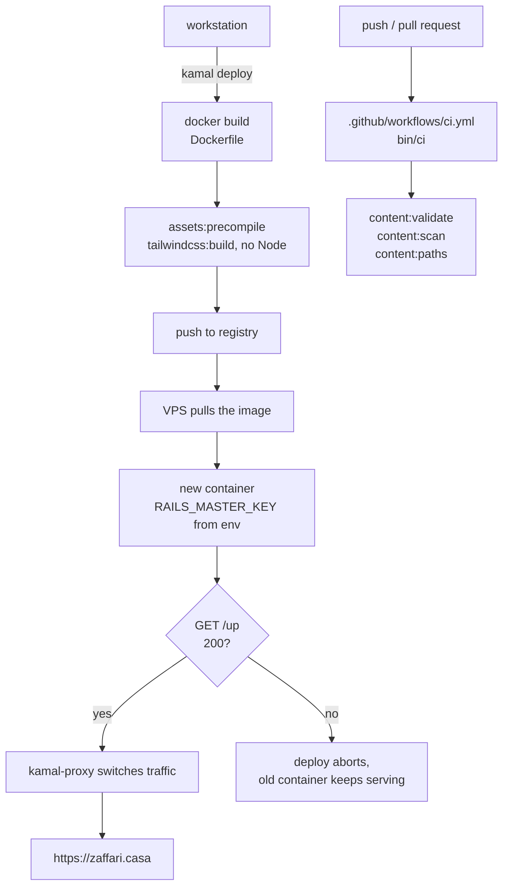

# Deployment — implementation

- Updated: 2026-08-06
- Code as of: repository commit `03e139a` (this feature is the working tree on
  top of it)
- Spec: [SPEC.md](SPEC.md)
- Status: **in-progress, and the status is the point.** The image, the Kamal
  configuration, the security headers, and the CI workflow all exist and are
  verified locally. Nothing has been deployed, because no server exists yet.
  Everything in [What the operator must supply](#what-the-operator-must-supply)
  is still outstanding, including the rollback exercise the SPEC requires.

## Entry points / flow



There is no `accessories:` block, no database container, and no volume. The
running topology is one process: Puma, serving Markdown it read from its own
image.

CI and deploy are deliberately not wired together — see
[Decisions](#decisions).

## Key files

| Path | Role |
|---|---|
| [`Dockerfile`](../../Dockerfile) | Two-stage production image. Assets compiled at build time, non-root runtime, no Node in either stage. |
| [`.dockerignore`](../../.dockerignore) | Excludes by default. This is the structural half of the SPEC's "no path to private source material" requirement. |
| [`config/deploy.yml`](../../config/deploy.yml) | Kamal 2 configuration. One host, one role, no accessories. Every operator-specific value is read from the environment. |
| [`.kamal/secrets`](../../.kamal/secrets) | Reference-only secret map. Committed, and safe to commit, because it holds no values. |
| [`config/application.rb`](../../config/application.rb) | Response headers, including the hand-written `Permissions-Policy`. |
| [`config/initializers/content_security_policy.rb`](../../config/initializers/content_security_policy.rb) | The CSP: `default-src 'none'`, `script-src 'none'`. |
| [`config/environments/production.rb`](../../config/environments/production.rb) | `force_ssl`, `assume_ssl`, and pinned HSTS options. |
| [`.github/workflows/ci.yml`](../../.github/workflows/ci.yml) | Runs `bin/ci` on push and pull request. No deploy job. |
| [`spec/requests/security_headers_spec.rb`](../../spec/requests/security_headers_spec.rb) | 47 examples asserting every header, the CSP, and that the page obeys its own policy. |

## Configuration

Four values are read from the deploying shell's environment. None is committed,
none has an invented default, and three of them abort the run with a named
error when unset:

| Variable | Meaning | Unset behaviour |
|---|---|---|
| `KAMAL_REGISTRY_SERVER` | Registry hostname, e.g. a GitHub Container Registry or Docker Hub endpoint | Aborts |
| `KAMAL_REGISTRY_USERNAME` | Registry account. Also forms the image path, `<username>/zaffari-casa` | Aborts |
| `KAMAL_HOST` | The VPS IP or hostname | Aborts |
| `KAMAL_SSH_USER` | SSH login | Defaults to `root`, which is Kamal's own default |

Two secrets are resolved through [`.kamal/secrets`](../../.kamal/secrets):

| Secret | Meaning |
|---|---|
| `KAMAL_REGISTRY_PASSWORD` | Registry access token |
| `RAILS_MASTER_KEY` | Contents of the gitignored `config/master.key` |

`RAILS_MASTER_KEY` is never present during the image build — `assets:precompile`
runs under `SECRET_KEY_BASE_DUMMY=1` instead — so it cannot end up in a layer.
Verified: `docker history --no-trunc` matches it zero times.

## Verification

Everything below was run against the real image, not reasoned about.

| Check | Result |
|---|---|
| `docker build` | Succeeds. Final image **375 MB** |
| `GET /`, `GET /pt-BR`, `GET /up` | 200 from the running container |
| Process user | `uid=1000(rails)`, non-root |
| Resident memory, idle | 87 MiB |
| `config/master.key` in image | Absent |
| `MASTER_KEY` in any build layer | 0 matches |
| `spec/`, `features/`, `.git/` in image | Absent |
| `data/` in image | Present, all eight record types |
| Stylesheet | Precompiled at build time, served with `max-age=31556952` |
| Script tags in served HTML | 0 |
| Inline style attributes in served HTML | 0 |
| `kamal config` | Resolves; writes nothing to the working tree |
| `bin/ci` | Exit 0, **174 examples, 0 failures** |

Headers observed on `GET /` from the production container:

```
content-security-policy: default-src 'none'; style-src 'self'; img-src 'self';
                         script-src 'none'; object-src 'none'; base-uri 'none';
                         form-action 'none'; frame-ancestors 'none'
strict-transport-security: max-age=63113904; includeSubDomains
permissions-policy: accelerometer=(), ambient-light-sensor=(), ... xr-spatial-tracking=()
x-content-type-options: nosniff
referrer-policy: strict-origin-when-cross-origin
x-frame-options: DENY
x-permitted-cross-domain-policies: none
x-xss-protection: 0
```

## Decisions

**`script-src 'none'`, and it costs nothing.** The page ships zero JavaScript,
so the strict policy that is usually aspirational is simply correct here. There
is no `unsafe-inline` anywhere, no nonce generator, and no exception. A nonce
generator was rejected specifically because the stock one keys off the session,
and this page has no other reason to touch a session.

**The CSP is asserted against the page, not just against itself.** Three
examples in the header spec parse the rendered HTML and fail if a `<script>`
tag, an inline `style`, or an off-origin subresource ever appears. A policy
only asserted as a string drifts away from the page it protects.

**`Permissions-Policy` is written by hand rather than through Rails' DSL.**
`config.permissions_policy` exists and works, and it emits the wrong header:
actionpack 8.1.3.1 still writes the superseded `Feature-Policy` name in the old
`camera 'none'` syntax, and says so in a comment at
`action_dispatch/http/permissions_policy.rb:26`. No current browser reads that
header, and its value is not even valid in a `Permissions-Policy`. Using the DSL
would have produced a header that looks like hardening and does nothing. A spec
asserts `Permissions-Policy` is present and `Feature-Policy` is absent, so this
decision fails loudly if a Rails upgrade changes it.

**Response headers live in `config/application.rb`, not an initializer.** They
have to. `ActionDispatch::Response.default_headers` is captured by the
`action_dispatch.configure` railtie initializer, which runs *before*
`config/initializers/*` are loaded — a `default_headers` hash assigned from an
initializer is built and then silently ignored. This was found by writing it in
an initializer first and watching the header not appear. The CSP is the
exception and does live in an initializer, because it is read per request.

**HSTS does not preload.** `includeSubDomains` is on and already has teeth: it
commits every future `*.zaffari.casa` to HTTPS. `preload` is a further, much
slower-to-reverse commitment and belongs to a site that has been up for a while,
not to a first deploy.

**`forward_headers` stays off.** kamal-proxy terminates TLS and nothing sits in
front of it, so any `X-Forwarded-For` arriving from outside is forged by
definition. The default overwrites them. Turn this on only if a CDN is ever
added.

**No `config.hosts`.** DNS-rebinding protection is off, as the Rails generator
leaves it. Enabling it before the first successful deploy is the classic way to
make every request return 403, including the proxy's health check. It is a
pending TODO on the SPEC for after the site is up.

**No deploy job in CI.** The trigger — merge to `main` versus manual — is still
an open decision in the SPEC, and guessing it in a workflow file would settle it
by accident. The workflow runs the gate and stops.

**No Thruster, no `RAILS_LOG_TO_STDOUT`, no error monitoring.** Thruster is not
in the `Gemfile` and kamal-proxy already fronts the app.
`config/environments/production.rb` logs to STDOUT unconditionally, so the
env var would be cargo. Monitoring is explicitly out of scope in the SPEC.

**`asset_path: /rails/public/assets`.** Lets the previous container's
fingerprinted stylesheet keep resolving through the rollover, so a page loaded a
second before a deploy does not lose its CSS. The path must match the
Dockerfile's `WORKDIR`.

## Deploying

Once the host exists:

```sh
export KAMAL_REGISTRY_SERVER=...
export KAMAL_REGISTRY_USERNAME=...
export KAMAL_HOST=...
export KAMAL_REGISTRY_PASSWORD=...
export RAILS_MASTER_KEY=$(cat config/master.key)

bin/ci                      # the gate that blocks a bad deploy
bundle exec kamal setup     # first time only: installs Docker, starts the proxy
bundle exec kamal deploy    # every time after
```

`kamal config` prints the fully resolved configuration and contacts no server;
it is the safe thing to run when something looks wrong. **Its output includes
resolved secrets — do not paste it into a public issue.**

## Rolling back

```sh
bundle exec kamal app versions      # list the versions still on the host
bundle exec kamal rollback <VERSION>
```

Kamal keeps the previous containers on the host (five by default), so a rollback
is a container swap and takes seconds — no rebuild, no registry round trip. The
new container must pass the same `/up` health check before traffic moves, so a
rollback to a version that cannot boot fails safe.

**This procedure is documented and untested.** The SPEC requires it be exercised
once, and that requires a host. It is the one acceptance criterion this work
could not meet, and it is recorded as a pending TODO rather than quietly
considered done.

## What the operator must supply

Nothing below can be inferred from the repository. This is the complete list.

**1. A server.** One small VPS, x86_64 (the builder targets `amd64`), with a
public IP, SSH access for `KAMAL_SSH_USER`, and inbound TCP 22, 80, and 443
open. 443 and 80 must both be reachable from the internet or the Let's Encrypt
challenge cannot complete. Kamal installs Docker itself during `kamal setup`.

**2. A container registry.** An account and an access token with push rights.
The image path will be `<KAMAL_REGISTRY_USERNAME>/zaffari-casa`; the repository
must exist or the registry must create it on first push.

**3. DNS.** An `A` record for `zaffari.casa` pointing at the VPS IP, resolving
*before* the first `kamal setup`, because kamal-proxy requests the certificate
during that run. Decide separately whether `www.zaffari.casa` gets a record —
today it is not served, and `config/deploy.yml` lists one host only.

**4. A git remote.** The repository currently has none, so
`.github/workflows/ci.yml` will not run anywhere until it is pushed to GitHub.

**5. The four environment variables and two secrets** listed under
[Configuration](#configuration), exported in the shell that runs the deploy.

**6. One-time `kamal setup`,** then a verification pass over HTTPS, then the
rollback exercise.

## Known limitations / pitfalls

- **`.gitignore` does not cover every file Kamal may read — reported, not
  fixed.** Kamal writes nothing to the working tree (verified: `kamal config`
  left `git status` untouched), and `.kamal/secrets` is committed on purpose
  because it holds only `$NAME` references. The gap is that Kamal also reads
  `.kamal/secrets-common` and `.kamal/secrets.<destination>` if they exist, and
  neither is ignored — those are the natural place for someone to paste a
  literal value, in a public repository. Adding `/.kamal/secrets-common` and
  `/.kamal/secrets.*` would close it. A second, unavoidable gap: `.kamal/secrets`
  is tracked, so an operator who inlines a value *into that file* commits it.
  The warning in its header is the only guard.
- **The base image pins a Debian codename by hand.** `ruby:4.0.6-slim-trixie`
  keeps a rebuild of an old commit reproducible, but nothing checks it against
  `.tool-versions`, and there is no Node toolchain here to check it for us.
  Bump both together.
- **`Gemfile.lock` must carry the `x86_64-linux` platform.** It does. Removing
  it, or building for `arm64` without adding that platform, breaks
  `bundle install` under `BUNDLE_DEPLOYMENT=1` — `tailwindcss-ruby` ships as a
  platform-specific gem.
- **`/up` renders an inline `style` attribute** — it is Rails' own
  `Rails::HealthController`, which returns
  `<body style="background-color: green">`. The CSP blocks that attribute, so
  the page is colourless. This is documented rather than fixed: the health check
  is judged on its status code, which is 200, and weakening `style-src` for a
  page no human looks at would be a bad trade.
- **Rails' static error pages carry an inline `<style>` block and no CSP.**
  `ActionDispatch::ShowExceptions` sits above the CSP middleware, so a 404
  response carries no policy at all and the inline style is not a violation.
  Verified against the running container. It also means those pages carry none
  of the other headers.
- **Precompiled Turbo and Stimulus JavaScript ships in `public/assets`.** The
  importmap pins them and Propshaft compiles them, but the layout renders no
  script tag, so nothing loads them and `script-src 'none'` blocks them anyway.
  They are dead weight in the image, not a hole.
- **A session cookie is set on every visit.** `csrf_meta_tags` in the layout
  touches the session. The site is stateless and does not need it. Out of scope
  here; worth revisiting.
- **Do not add an `accessories:` block.** It is the single most likely way this
  configuration acquires a database, which every other decision in this project
  was made to avoid.
