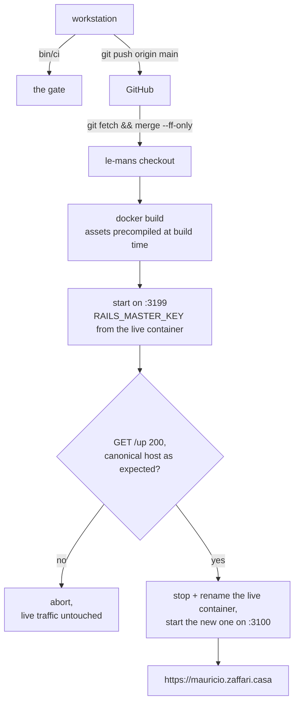

# Deployment — implementation

- Updated: 2026-10-03
- Code as of: repository commit `1cfaddb`
- Spec: [SPEC.md](SPEC.md)
- Status: **in-progress.** The site is live over HTTPS at
  `https://mauricio.zaffari.casa` from a single stateless container, and every
  feature in this backlog is served from it. The one unmet acceptance criterion
  is unchanged and is the reason this is not `implemented`: **the rollback has
  never been exercised end to end.**

## The live topology, and how it differs from `config/deploy.yml`

This is the part the first version of this document got wrong, so it is stated
first.

`config/deploy.yml` describes a **Kamal deploy to a public VPS**. That
configuration is complete and self-consistent, and **it has never been run.**

What exists instead is a plain Docker container on the house host:

| | |
|---|---|
| Host | `le-mans`, `192.168.1.253` on the LAN, x86_64, reachable as `ssh le-mans` |
| Source | a checkout at `/home/mauricio/development/portfolio` on that host, pulling `main` from GitHub over HTTPS |
| Image | `portfolio`, built on the host with `docker build` from `Dockerfile` |
| Container | `portfolio`, `--restart unless-stopped`, `0.0.0.0:3100->3100/tcp`, no mounts, no accessories |
| Runtime env | `RAILS_ENV=production`, `PORT=3100`, `RAILS_MASTER_KEY` |
| TLS | a Let's Encrypt **wildcard** `*.zaffari.casa` certificate, obtained by DNS-01 on that host, terminating in front of the container |
| DNS | `mauricio.zaffari.casa` and `zaffari.casa` both resolve to `192.168.1.253` |

There is no container registry in the path, so there is nothing to push or pull:
the image is built where it runs. That is possible because the host is ours and
the source is public. A future move to a real VPS is what `config/deploy.yml`
and the Kamal values under [Configuration](#configuration) are for.

`git pull` on that host runs a `post-merge` hook that prints "Deployment
complete!" — that hook belongs to the **dotfiles** repository, not to this one,
and it does not touch this container. Do not read it as this app having
deployed.

## Entry points / flow



`bin/deploy` is that flow. It is not Kamal, and it deliberately mirrors the
manual procedure a human would run, so there is one description of the deploy
rather than two.

There is no `accessories:` block, no database container, and no volume. The
running topology is one process: Puma, serving Markdown it read from its own
image.

CI and deploy are deliberately not wired together — see
[Decisions](#decisions).

## Key files

| Path | Role |
|---|---|
| [`Dockerfile`](../../Dockerfile) | Two-stage production image. Assets compiled at build time, non-root runtime, no Node in either stage. |
| [`.dockerignore`](../../.dockerignore) | Excludes by default. This is the structural half of the SPEC's "no path to private source material" requirement. |
| [`bin/deploy`](../../bin/deploy) | The deploy. Blue/green on the house host: verify `portfolio:new` on a spare port, check the canonical host it serves, only then swap `:3100`. `bin/deploy --rollback` puts the previous container back. |
| [`config/deploy.yml`](../../config/deploy.yml) | Kamal 2 configuration for a public VPS. Complete, and **never run** — see the live topology above. |
| [`.kamal/secrets`](../../.kamal/secrets) | Reference-only secret map. Committed, and safe to commit, because it holds no values. |
| [`config/application.rb`](../../config/application.rb) | Response headers, including the hand-written `Permissions-Policy`. |
| [`config/initializers/content_security_policy.rb`](../../config/initializers/content_security_policy.rb) | The CSP: `default-src 'none'`, `script-src 'none'`. |
| [`config/environments/production.rb`](../../config/environments/production.rb) | `force_ssl`, `assume_ssl`, and pinned HSTS options. |
| [`.github/workflows/ci.yml`](../../.github/workflows/ci.yml) | Runs `bin/ci` on push and pull request. No deploy job. |
| [`spec/requests/security_headers_spec.rb`](../../spec/requests/security_headers_spec.rb) | 47 examples asserting every header, the CSP, and that the page obeys its own policy. |

## Configuration

Four values are read from the deploying shell's environment. None is committed,
none has an invented default, and three of them abort the run with a named
error when unset:

| Variable | Meaning | Unset behaviour |
|---|---|---|
| `KAMAL_REGISTRY_SERVER` | Registry hostname, e.g. a GitHub Container Registry or Docker Hub endpoint | Aborts |
| `KAMAL_REGISTRY_USERNAME` | Registry account. Also forms the image path, `<username>/zaffari-casa` | Aborts |
| `KAMAL_HOST` | The VPS IP or hostname | Aborts |
| `KAMAL_SSH_USER` | SSH login | Defaults to `root`, which is Kamal's own default |

Two secrets are resolved through [`.kamal/secrets`](../../.kamal/secrets):

| Secret | Meaning |
|---|---|
| `KAMAL_REGISTRY_PASSWORD` | Registry access token |
| `RAILS_MASTER_KEY` | Contents of the gitignored `config/master.key` |

`RAILS_MASTER_KEY` is never present during the image build — `assets:precompile`
runs under `SECRET_KEY_BASE_DUMMY=1` instead — so it cannot end up in a layer.
Verified: `docker history --no-trunc` matches it zero times.

## Verification

Everything below was run against the real image, not reasoned about.

| Check | Result |
|---|---|
| `docker build` | Succeeds. Final image **375 MB** |
| `GET /`, `GET /pt-BR`, `GET /up` | 200 from the running container |
| Process user | `uid=1000(rails)`, non-root |
| Resident memory, idle | 87 MiB |
| `config/master.key` in image | Absent |
| `MASTER_KEY` in any build layer | 0 matches |
| `spec/`, `features/`, `.git/` in image | Absent |
| `data/` in image | Present, all eight record types |
| Stylesheet | Precompiled at build time, served with `max-age=31556952` |
| Script tags in served HTML | 0 at the time of this measurement. [site-metadata](../site-metadata/IMPLEMENTATION.md) later added one `type="application/ld+json"` data block, which is never executed and raises no CSP violation — verified in Chromium |
| Inline style attributes in served HTML | 0 |
| `kamal config` | Resolves; writes nothing to the working tree |
| `bin/ci` | Exit 0, **445 examples, 0 failures**, 100% line and branch coverage at `1cfaddb`. Later features add examples; `bin/rspec` reports the current count |
| Live over HTTPS | `https://mauricio.zaffari.casa/` serves the page, `/llms.txt`, `/openapi.json`, `/mcp` and the `/.well-known` documents from the container on `le-mans` |

Headers observed on `GET /` from the production container:

```
content-security-policy: default-src 'none'; style-src 'self'; img-src 'self';
                         script-src 'none'; object-src 'none'; base-uri 'none';
                         form-action 'none'; frame-ancestors 'none'
strict-transport-security: max-age=63113904; includeSubDomains
permissions-policy: accelerometer=(), ambient-light-sensor=(), ... xr-spatial-tracking=()
x-content-type-options: nosniff
referrer-policy: strict-origin-when-cross-origin
x-frame-options: DENY
x-permitted-cross-domain-policies: none
x-xss-protection: 0
```

## Decisions

**`script-src 'none'`, and it costs nothing.** The page ships zero JavaScript,
so the strict policy that is usually aspirational is simply correct here. There
is no `unsafe-inline` anywhere, no nonce generator, and no exception. A nonce
generator was rejected specifically because the stock one keys off the session,
and this page has no other reason to touch a session.

**The CSP is asserted against the page, not just against itself.** Three
examples in the header spec parse the rendered HTML and fail if a `<script>`
tag, an inline `style`, or an off-origin subresource ever appears. A policy
only asserted as a string drifts away from the page it protects.

**`Permissions-Policy` is written by hand rather than through Rails' DSL.**
`config.permissions_policy` exists and works, and it emits the wrong header:
actionpack 8.1.3.1 still writes the superseded `Feature-Policy` name in the old
`camera 'none'` syntax, and says so in a comment at
`action_dispatch/http/permissions_policy.rb:26`. No current browser reads that
header, and its value is not even valid in a `Permissions-Policy`. Using the DSL
would have produced a header that looks like hardening and does nothing. A spec
asserts `Permissions-Policy` is present and `Feature-Policy` is absent, so this
decision fails loudly if a Rails upgrade changes it.

**Response headers live in `config/application.rb`, not an initializer.** They
have to. `ActionDispatch::Response.default_headers` is captured by the
`action_dispatch.configure` railtie initializer, which runs *before*
`config/initializers/*` are loaded — a `default_headers` hash assigned from an
initializer is built and then silently ignored. This was found by writing it in
an initializer first and watching the header not appear. The CSP is the
exception and does live in an initializer, because it is read per request.

**HSTS does not preload.** `includeSubDomains` is on and already has teeth: it
commits the canonical host and everything beneath it to HTTPS. `preload` is a further, much
slower-to-reverse commitment and belongs to a site that has been up for a while,
not to a first deploy.

**`forward_headers` stays off.** kamal-proxy terminates TLS and nothing sits in
front of it, so any `X-Forwarded-For` arriving from outside is forged by
definition. The default overwrites them. Turn this on only if a CDN is ever
added.

**No `config.hosts`.** DNS-rebinding protection is off, as the Rails generator
leaves it. Enabling it before the first successful deploy is the classic way to
make every request return 403, including the proxy's health check. It is a
pending TODO on the SPEC for after the site is up.

**No deploy job in CI.** The trigger — merge to `main` versus manual — is still
an open decision in the SPEC, and guessing it in a workflow file would settle it
by accident. The workflow runs the gate and stops.

**No Thruster, no `RAILS_LOG_TO_STDOUT`, no error monitoring.** Thruster is not
in the `Gemfile` and kamal-proxy already fronts the app.
`config/environments/production.rb` logs to STDOUT unconditionally, so the
env var would be cargo. Monitoring is explicitly out of scope in the SPEC.

**`asset_path: /rails/public/assets`.** Lets the previous container's
fingerprinted stylesheet keep resolving through the rollover, so a page loaded a
second before a deploy does not lose its CSS. The path must match the
Dockerfile's `WORKDIR`.

## Deploying

```sh
bin/ci                       # the gate: never deploy a red tree
git push origin main         # le-mans pulls from GitHub, not from this checkout
bin/deploy                   # build on the host, verify on :3199, then swap :3100
```

What `bin/deploy` does, in order, and why each step exists:

1. **Fast-forwards the host's checkout** (`git fetch && git merge --ff-only`).
   It refuses to continue if the host has diverged, rather than merging blind.
2. **Builds `portfolio:new` on the host.** `assets:precompile` runs at build
   time under `SECRET_KEY_BASE_DUMMY=1`, so `RAILS_MASTER_KEY` is never in a
   layer. The build is the slow part — roughly two to four minutes on `le-mans`.
3. **Starts the new image on `:3199`** with the runtime environment copied from
   the live container (`PORT`, `RAILS_ENV`, and `RAILS_MASTER_KEY`). The master
   key is read out of `docker inspect` on the host and passed through the shell;
   it is never printed and never written to a file.
4. **Verifies before it swaps.** `GET /up` must return 200, and `GET /` must
   carry `<link rel="canonical" href="https://mauricio.zaffari.casa/">`. A build
   that boots but serves the wrong origin is the exact regression this feature
   exists to prevent, so it is checked, not assumed.
5. **Swaps.** The live container is stopped and renamed `portfolio-previous`,
   the new one takes `:3100`, and the image is retagged `portfolio:latest`. If
   the new container does not answer `/up` within 30 seconds it is removed and
   the previous container is started again, automatically.
6. **Leaves the previous container in place.** It is stopped, not removed, so
   the rollback is instant and needs no rebuild.

Downtime is the second or two between stopping one container and starting the
next. The site is one page on a LAN host; that is an accepted trade for having a
rollback that does not depend on a registry.

### Deploying somewhere else

`bin/deploy` reads three optional variables, so the same script can target
another host without being edited:

```sh
PORTFOLIO_HOST=some-host PORTFOLIO_DIR=/srv/portfolio \
  PORTFOLIO_PORT=3100 PORTFOLIO_CANONICAL_HOST=example.test bin/deploy
```

## Rolling back

```sh
bin/deploy --rollback
```

It removes the current container, renames `portfolio-previous` back to
`portfolio`, starts it, and waits for `/up`. If that never goes green it exits
non-zero and says so rather than leaving you guessing.

The image is also tagged: `portfolio:previous` is the image the last deploy
replaced. To go further back, `docker tag portfolio:previous portfolio:latest`
on the host and run `bin/deploy --no-build`.

**Exercising this is still a pending TODO.** The SPEC requires a rollback to be
run once, deliberately, with the site up. Everything needed for it exists and
the path is exercised by construction on every deploy — the new container is
never trusted before it is healthy — but a real rollback has not been performed
on purpose, and this document does not claim otherwise.

## What the environment already supplies

Recorded because the previous version of this section listed these as
outstanding, and none of them is.

| Requirement | State |
|---|---|
| A host, x86_64, with Docker and SSH | `le-mans` — `ssh le-mans` works with the operator's key, and `docker` is usable without `sudo` |
| A source checkout on the host | `/home/mauricio/development/portfolio`, tracking `origin/main` over HTTPS |
| DNS for the canonical host | `mauricio.zaffari.casa` → `192.168.1.253`, resolving |
| TLS | a Let's Encrypt wildcard `*.zaffari.casa`, DNS-01, already served in front of the container |
| A git remote | `origin` is `github.com:mauriciozaffari/portfolio`, and `main` is pushed |
| A container registry | **not needed** — the image is built where it runs |
| `RAILS_MASTER_KEY` | already in the live container's environment; `config/master.key` is not in this checkout |
| The Kamal values | not needed for the live path; still required if the site ever moves to a VPS |

The only thing a deployer needs is SSH access to `le-mans` as `mauricio`.

## Known limitations / pitfalls

- **`.gitignore` does not cover every file Kamal may read — reported, not
  fixed.** Kamal writes nothing to the working tree (verified: `kamal config`
  left `git status` untouched), and `.kamal/secrets` is committed on purpose
  because it holds only `$NAME` references. The gap is that Kamal also reads
  `.kamal/secrets-common` and `.kamal/secrets.<destination>` if they exist, and
  neither is ignored — those are the natural place for someone to paste a
  literal value, in a public repository. Adding `/.kamal/secrets-common` and
  `/.kamal/secrets.*` would close it. A second, unavoidable gap: `.kamal/secrets`
  is tracked, so an operator who inlines a value *into that file* commits it.
  The warning in its header is the only guard.
- **The base image pins a Debian codename by hand.** `ruby:4.0.6-slim-trixie`
  keeps a rebuild of an old commit reproducible, but nothing checks it against
  `.tool-versions`, and there is no Node toolchain here to check it for us.
  Bump both together.
- **`Gemfile.lock` must carry the `x86_64-linux` platform.** It does. Removing
  it, or building for `arm64` without adding that platform, breaks
  `bundle install` under `BUNDLE_DEPLOYMENT=1` — `tailwindcss-ruby` ships as a
  platform-specific gem.
- **`/up` renders an inline `style` attribute** — it is Rails' own
  `Rails::HealthController`, which returns
  `<body style="background-color: green">`. The CSP blocks that attribute, so
  the page is colourless. This is documented rather than fixed: the health check
  is judged on its status code, which is 200, and weakening `style-src` for a
  page no human looks at would be a bad trade.
- **Rails' static error pages carry an inline `<style>` block and no CSP.**
  `ActionDispatch::ShowExceptions` sits above the CSP middleware, so a 404
  response carries no policy at all and the inline style is not a violation.
  Verified against the running container. It also means those pages carry none
  of the other headers.
- **Precompiled Turbo and Stimulus JavaScript ships in `public/assets`.** The
  importmap pins them and Propshaft compiles them, but the layout renders no
  script tag, so nothing loads them and `script-src 'none'` blocks them anyway.
  They are dead weight in the image, not a hole.
- **The session cookie gap is closed.** The layout renders neither
  `csrf_meta_tags` nor `csp_meta_tag`, and
  `spec/requests/session_cookie_spec.rb` fails the build if any route sets a
  cookie.
- **Cloudflare's AI-bot protection was blocking GPTBot and ClaudeBot, and the
  fix is zone-wide (2026-10-03).** The public `A` records for `zaffari.casa` are
  Cloudflare's, and the edge answered **403** to GPTBot and ClaudeBot while the
  origin answered 200 to the same User-Agents. The cause was the zone's
  `bot_management` setting `ai_bots_protection: block`, set from the **Casa
  Zaffari** Cloudflare account (`mauricio.shakur@gmail.com` — a different login
  from the one holding `develoz.com`). It is now `disabled`, which the Cloudflare
  API only accepts at zone level: there is no per-host or per-crawler lever, so
  this also unblocks AI crawlers on the apex, which serves a different
  application.

  Revert, from a `cf` profile attached to that account:

  ```sh
  cf auth create zaffari --no-browser --device     # approve as mauricio.shakur@gmail.com
  # then, against the zone id 503391f99e9293cd0100060dbacf2653:
  #   PUT /zones/<id>/bot_management {"ai_bots_protection": "block"}
  ```

  A side effect worth knowing: the same update moved `ai_training` from
  `disallow` to `disabled`. That is *toward* this site's stated policy — its
  robots.txt allows AI on purpose — but it is a zone-level declaration, so it
  also applies to the apex.
- **The live container is not managed by Kamal or by a compose file.** It is a
  `docker run` on `le-mans`, so nothing reconciles it: a change made by hand on
  that host survives until the next `bin/deploy` replaces the container. That is
  the price of the simple path, and it is why `bin/deploy` reads the runtime
  environment from the container rather than from a committed file.
- **Do not add an `accessories:` block.** It is the single most likely way this
  configuration acquires a database, which every other decision in this project
  was made to avoid.
