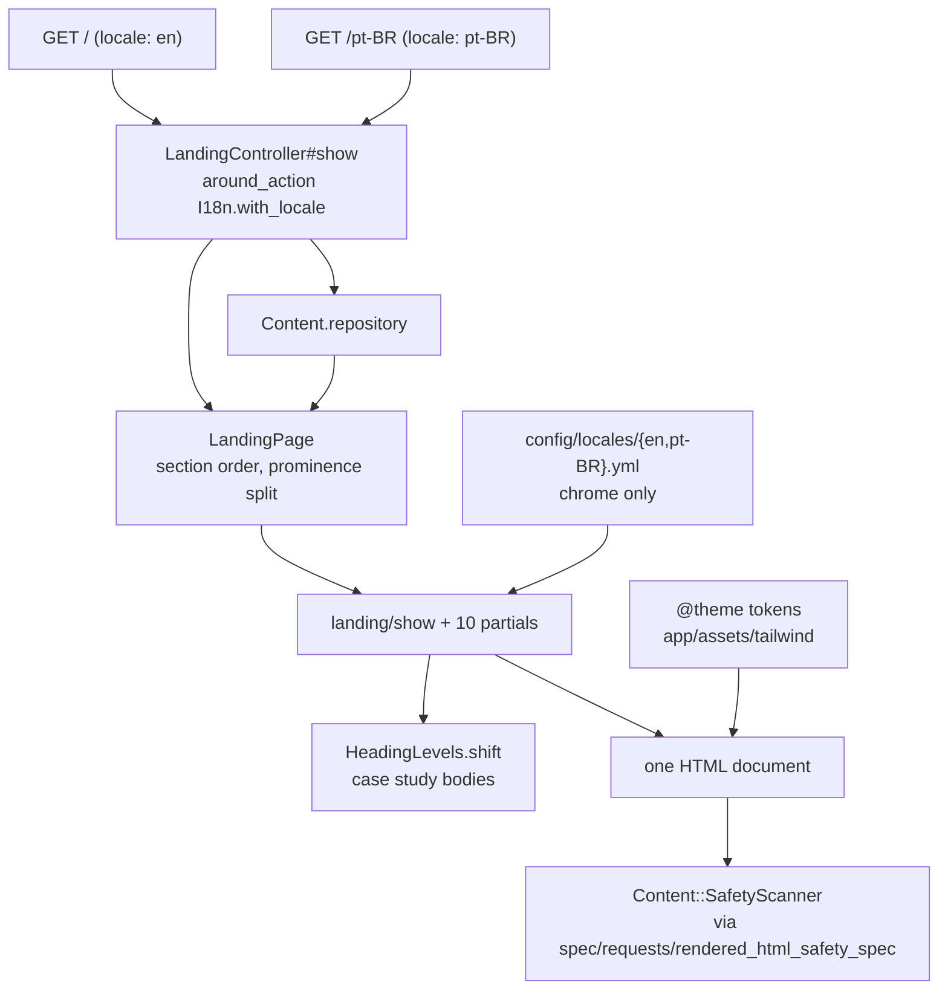

# Landing Page — implementation

- Updated: 2026-08-06
- Code as of: repository commit `539541b` (this feature is the working tree on
  top of it)
- Spec: [SPEC.md](SPEC.md) · Visual language: [DESIGN.md](../../DESIGN.md)

One page, two canonical URLs, no database, no JavaScript. Everything a reader
would call content comes out of `data/**/*.md` through the loader that landed in
`539541b`; what this feature adds is the order a reader meets it in, the markup,
and the visual language.

## Entry points / flow

The controller does three things and nothing else: scope the locale, build a
`LandingPage`, render. There is no branching on locale anywhere else — the
fallback is the loader's, and the chrome is I18n's.

## Key files

| Path | Role |
|---|---|
| [config/routes.rb](../../config/routes.rb) | Two static routes, both `landing#show`, each supplying `locale` as a route default. |
| [app/controllers/landing_controller.rb](../../app/controllers/landing_controller.rb) | Reads the locale from the route default and scopes `I18n` around the action. |
| [app/models/landing_page.rb](../../app/models/landing_page.rb) | Composes the sections for one locale: prominence split, ordering, and the page-wide `substituted?` question. |
| [app/models/heading_levels.rb](../../app/models/heading_levels.rb) | Demotes the headings inside a rendered record body so a case study does not claim the page's outline. |
| [app/helpers/landing_helper.rb](../../app/helpers/landing_helper.rb) | The anchor list, the locale switcher, date formatting, and the substitution attributes. |
| [app/views/landing/show.html.erb](../../app/views/landing/show.html.erb) | The whole page skeleton in one readable file: skip link, header, eight sections, footer. |
| `app/views/landing/_section.html.erb` | The partial layout every section shares: the gutter grid and the numbered mono label. |
| `app/views/landing/_{masthead,metric,role,earlier_role,case_study,project,skill_group,education_entry}.html.erb` | One partial per record type. |
| `app/views/landing/_{locale_switcher,substitution}.html.erb` | The language switcher and the per-record substitution marker. |
| [app/assets/tailwind/application.css](../../app/assets/tailwind/application.css) | The whole design system: `@theme` tokens, base layer, component classes. |
| [config/locales/en.yml](../../config/locales/en.yml), [config/locales/pt-BR.yml](../../config/locales/pt-BR.yml) | Interface chrome and date formats. No content. |
| [app/views/layouts/application.html.erb](../../app/views/layouts/application.html.erb) | `lang` per locale, title from `site_profile`, one stylesheet, no script tag. |

Deleted, because they were the placeholder this feature replaces:
`app/controllers/home_controller.rb`, `app/views/home/`,
`spec/requests/home_spec.rb`, `app/assets/stylesheets/application.css` (an
empty manifest that cost a second stylesheet request), and `app/javascript/`.

## Configuration

None. No environment variables, no initializer, no new gem. `config/locales`
gains a `pt-BR` file, which Rails loads by convention.

## Decisions

**Chrome is I18n, content is the loader, and the test for which is whether the
element can be marked.** The SPEC's rule is that no copy lives in a view. Section
labels, the skip link, "present", "Earlier roles" and the date formats are not
content — there is no record for them, and `/pt-BR` needs them in Portuguese, so
they live in `config/locales/**`. Every name, headline, figure, date, role,
client and sentence comes from a record.

The boundary between the two is not "which file is it in". It is:

> **Can this element carry a substitution marker? If it cannot, it must be
> chrome.**

Content is allowed to arrive in the wrong language, because the fallback marks
it: the container gets `lang` and a visible `[EN]`, and the reader is told what
happened. Chrome has nowhere to put that marker, so content reaching a chrome
slot has no way to explain itself and simply reads as a bug.

The section index is the worked example, and it was got wrong first. Its
leadership label was originally `leadership.title`, on the reasoning that a
navigation entry should match the heading it points at. It should not. A
navigation entry is an index, it is one word inside a row of six translated
siblings, and it cannot be marked — so on `/pt-BR` an unexplained "How I work"
sat between "Trabalhos selecionados" and "Código aberto". The label is now
`landing.leadership.heading` in both locale files.

The section's own `<h2>` still renders `leadership.title`, unchanged, and on
`/pt-BR` it correctly shows the English title inside a container carrying
`lang="en"` and an `[EN]` marker. The two are *supposed* to differ: one is an
index label, the other is the record's own title. Once a pt-BR `leadership`
record exists they may still differ in wording, and that is fine.

Applying the same test to the rest of the frame found one near-miss and one
hybrid, both already correct:

- **The footer contact links stay content.** Their labels come from
  `site_profile.links`, and moving them into a locale file would create a second
  source for the one surface the publication policy is strictest about — the
  four-entry contact allowlist that `content:scan` enforces. Unlike a navigation
  item, that footer block *can* be marked and is: `lang="en"` plus the `[EN]`
  marker, so an English "Email" on `/pt-BR` reads as declared fallback.
- **"Content last reviewed …" is a hybrid, split correctly.** The sentence is
  `landing.contact.reviewed`; the date is `site_profile.updated` rendered through
  the requested locale's `date.formats.day_month_year`, so `/pt-BR` reads
  "Conteúdo revisado em 6 de agosto de 2026". The chrome is translated and the
  value is content.

Everything else in the header, the navigation and the footer was already I18n.
After the fix the header contains no record-derived value at all.

**Two `<section>` elements for the "experience and case studies" beat.** The
SPEC fixes seven narrative beats; this renders eight sections, because a case
study body opens with `## Problem` at `h2`. Folding both into one section would
put Problem/Approach/Outcome at `h5` under a sub-sub-heading. `#experience` and
`#work` are adjacent and in the SPEC's order, so the narrative is unchanged and
the outline stays honest.

**Heading levels are shifted, not restyled.** `HeadingLevels.shift(html, by: 2)`
rewrites `h2`/`h3`/`h4` tags in an already-sanitized body. This is safe in
exactly this direction because `Content::Markdown`'s allowlist admits those three
tags with no attributes at all, and a spec asserts that allowlist so the offset
of 2 cannot silently become wrong. It lives here rather than in
`Content::Markdown` because the offset is a property of where the page puts the
body, not of the record. CSS cannot do this: the requirement is semantic.

**No ordering key exists, so ordering is derived.** Chronological where a record
carries a date (experience by `start_date`, case studies by the leading year of
`period`, education by `year`), by magnitude where it carries one (open source by
`downloads`), and by the loader's id order otherwise (metrics, skill groups).
`start_date` is converted to a month count rather than compared as a string, so
`2018-07` sorts after `2018` instead of beside it.

**Hotwire earns nothing here, and the number is why.** Turbo Drive was
implemented, measured, and removed: 105,579 bytes uncompressed, 61% of the page's
entire transfer, in exchange for avoiding one full page load on the locale
switch — the only navigation this site has, and one most visitors never use.
Stimulus was removed first and more easily: zero controllers, and an eager-loading
pin ships the framework plus its loader to register nothing. The page now emits
**no `<script>` tag at all**, which also makes the JavaScript-disabled acceptance
criterion true by construction rather than by care. The gems stay in the Gemfile
because app-foundation owns the dependency set, and `bin/importmap audit` stays in
`bin/ci` so a future pin cannot arrive unaudited. The rationale is repeated at the
point of enforcement, in [config/importmap.rb](../../config/importmap.rb).

**Zero web fonts, stated as a budget rather than discovered as a limit.** The
SPEC asks for a declared web-font budget; it is zero bytes and zero requests.
A self-hosted variable font would cost a request plus either a `font-display`
swap reflow or metric overrides tuned per fallback — against an acceptance
criterion that forbids layout shift from late-arriving assets. The voice comes
from the pairing instead: sans for what is said, mono for what is measured, with
`tabular-nums` on every figure. Full reasoning in [DESIGN.md](../../DESIGN.md) §3.

**Tailwind namespaces are reset before the tokens are declared.** Every
`@theme` namespace this page uses opens with `--namespace-*: initial`. That turns
"every value traces to a token" from a claim into a build-time fact: with the
default palette and scale removed, `text-blue-500`, `rounded-2xl` and `shadow-lg`
are not classes that exist, and an undeclared value fails as a missing utility
rather than slipping in as an orphan hex.

**Section ordinals are a CSS counter.** `01`–`07` come from
`counter(section, decimal-leading-zero)` on `.section-label::before`, so no
markup carries a number that could drift from the order the sections are
actually in, and the ordinals are correctly absent from the accessibility tree.

**The substitution state is a `tag` builder, not an attribute string.** The
natural way to write this is `<article <%= attributes %>>`, and `herb analyze`
rejects an ERB output tag in attribute position — correctly, since it is a raw
attribute splat. `substitution_attributes` therefore returns a Hash and the ten
partials that need it open with `tag.article(...) do`. `<%= yield %>` still works
inside those blocks: `yield` binds to the template method, not to the Ruby block.

## Verified non-functionals

Measured in Chromium against the running application, not asserted from theory.

**Transfer.** `/` is **4 requests and 66,531 bytes uncompressed** — document
41,241, stylesheet 21,002, `icon.svg` 122, `icon.png` 4,166. Gzipped, which is
what the proxy will serve, that is **18.5 KB**: HTML 9,811, CSS 4,811, icons
4,288 (already compressed). `/pt-BR` is 73,324 bytes uncompressed and 18.9 KB
gzipped; the difference is the 35 substitution markers and their
visually-hidden sentences. Zero third-party origins, zero scripts, zero fonts.

**Layout shift.** Cumulative layout shift measured **0** via
`PerformanceObserver`. There is nothing to shift: no images, no web font, no
JavaScript.

**JavaScript disabled.** Verified in a `javaScriptEnabled: false` browser
context, not reasoned about. All 7 `<section>` elements and all 45 prose
paragraphs render; clicking the `#skills` anchor lands the section 32px from the
viewport top, exactly the `--scroll-offset`; "Back to top" returns to the
document head; the locale switcher navigates to `/pt-BR` and the substituted
records still carry their markers.

**Accessibility.** Exactly one `<h1>`; the heading sequence over the whole
document is `1,2,2,3,3,3,3,4×9,2,3,4,4,4,…,2,2,3,3,3,2,3×7,2` with no level
skipped; `header`/`nav`/`main`/`footer` landmarks present; every in-page anchor
resolves to a real element id (asserted in the request spec, so a rename cannot
leave a dead link); focus is a 2px accent outline with 2px offset and never a
border, so focusing shifts nothing; `prefers-reduced-motion: reduce` was
confirmed to switch `scroll-behavior` to `auto` and transitions to `1e-05s`.
Every text colour clears WCAG AA against the one surface — ratios measured and
tabled in [DESIGN.md](../../DESIGN.md) §2.

**Measure.** Prose caps at `--container-measure` (58ch), which renders 67–72
characters per line at 1280px and 1024px, inside the 60–75 target. At 375px it
is 35–40, which is the correct mobile measure.

**Screenshots.** `/` and `/pt-BR` at 375, 768 and 1280 px, plus focus, hover and
no-JavaScript states. Two real defects were found by looking at them and fixed:
the section boundary rule doubled with the first row's rule (now
`first:border-t-0`), and the middot separators wrapped to the *start* of the next
line (the separator is now an `::after` glued to the item it follows). The
screenshots were deliberately not committed — `.playwright-mcp/` is not
gitignored, and this repository is public.

## Testing

| Spec | What it proves |
|---|---|
| [spec/requests/landing_spec.rb](../../spec/requests/landing_spec.rb) | Shared examples run against both locales: 200, every section id present, the four landmarks, exactly one `h1`, no heading-level skip, name and headline sourced from `site_profile`, every in-page anchor resolving, the footer publishing exactly the approved links and nothing else, both canonical URLs offered with one marked `aria-current`, no unresolved translation, and no non-relative asset URL or `@font-face`. Then per locale: `html lang`, that `/` substitutes nothing, that `?locale=pt-BR` cannot serve Portuguese from `/`, and that `/pt-BR` translates the frame, shows the notice once, marks every substituted container with `lang="en"`, and hides the marker from assistive technology while explaining it in text. |
| `spec/requests/landing_spec.rb`, "the section index across both locales" | The chrome-versus-content boundary above, locked down: the index covers every section but the masthead; **no Portuguese label equals its English string**; the leadership entry is the I18n key and specifically *not* the record's `title`; and the leadership `<h2>` is still the record's title, still `lang="en"`, still marked. Verified to fail — reintroducing the record-derived label fails two of the four with `expected ["How I work"].empty? to be truthy`. |
| [spec/models/landing_page_spec.rb](../../spec/models/landing_page_spec.rb) | The prominence split foregrounds without discarding; every derived ordering, including a dated month sorting after a bare year; drafts and restricted records unreachable; and the fallback serving the whole page from the locale that does exist. |
| [spec/models/heading_levels_spec.rb](../../spec/models/heading_levels_spec.rb) | The offset applies to headings and nothing else, stops at `h6`, returns renderable markup, matches a real case study, and — the guard that matters — fails if the sanitizer's heading allowlist ever widens past `h4`. |
| [spec/requests/rendered_html_safety_spec.rb](../../spec/requests/rendered_html_safety_spec.rb) | Unchanged from `539541b` and now covering both new routes, because it is driven by the routing table. The content-safety scanner finds nothing unpublishable in either rendered page. |

`bin/ci` is green: RuboCop (45 files), `herb analyze` (13 files),
`content:validate`, `content:scan`, `content:paths`, `importmap audit`, and 123
RSpec examples.

## Known limitations / pitfalls

- **A new section needs a locale key, not a record field.** Adding one to
  `landing_sections` without adding `landing.<id>.heading` to *both*
  `config/locales/**` files leaves the index half-translated, and the temptation
  is always to reach for a record value that is already there. The spec above
  fails if you do.
- **Metrics and skill groups render in alphabetical id order.** Neither type
  carries a date, a magnitude, or an ordering key, so there is nothing to sort
  by and the page does not invent an editorial claim. The fix is a
  `curated-content` schema change, and it is parked in that feature's SPEC
  rather than smuggled in here.
- **Date ranges must keep the spaced en dash.** `role_period` joins with
  `" – "` because `Content::SafetyScanner` cannot distinguish `2012-2013` from a
  Brazilian landline and should not try. Anything that reformats a range has to
  keep a space or a non-hyphen dash on both sides, or `bin/ci` fails on the
  rendered HTML.
- **A mono figure at 44px opens up a wide word space.** `R$ 482,800+` shows a
  visible gap after the currency prefix, because a monospace space is 0.6em. It
  is a property of the face rather than a bug, it varies by platform, and the
  alternative is giving up aligned figures. Recorded so it is not mistaken for a
  markup error.
- **`open_source.name` is set in mono for all three records.** Two are gem names,
  where mono is exactly right; "Ruby and Rails ecosystem" is prose wearing a gem
  name's clothes. Special-casing on the value would put a content judgement in a
  view, so it renders like its siblings.
- **`source_url` is loaded but never rendered.** Four records carry public
  evidence for a claim and the page does not link it yet. Surfacing it means
  either an accent link inside a figure or a new chrome label, so it is a
  deliberate SPEC TODO rather than a silent omission.
- **The mobile section index costs three rows.** Seven mono labels wrap to three
  lines at 375px, so roughly 175px of chrome precedes the name. That is the price
  of a table of contents on an 18,500px document, and the name still lands above
  the fold. Hiding the index below `md` would remove in-page navigation exactly
  where the page is longest.
- **Both favicon links fire on every load.** `icon.png` is 4,166 bytes and is now
  the single largest asset after the HTML and the CSS. It is generator output
  that [site-metadata](../site-metadata/SPEC.md) owns, so it was measured and
  left alone rather than optimised across a feature boundary.
- **`tailwind.css` must be rebuilt after a class changes.** `bin/dev` watches,
  `bin/ci` does not — it lints and tests the Ruby and reads the committed-in-name
  build artifact. A stale build shows up as a class that silently does nothing,
  which is the failure mode of resetting the Tailwind namespaces. Run
  `bin/rails tailwindcss:build` when a screenshot looks wrong before suspecting
  the markup.
- **Fragment navigation does not re-request the document.** During QA a
  `/#experience` visit reused the already-loaded page and showed pre-change
  markup. Reload explicitly when verifying a template edit through an anchor URL.
