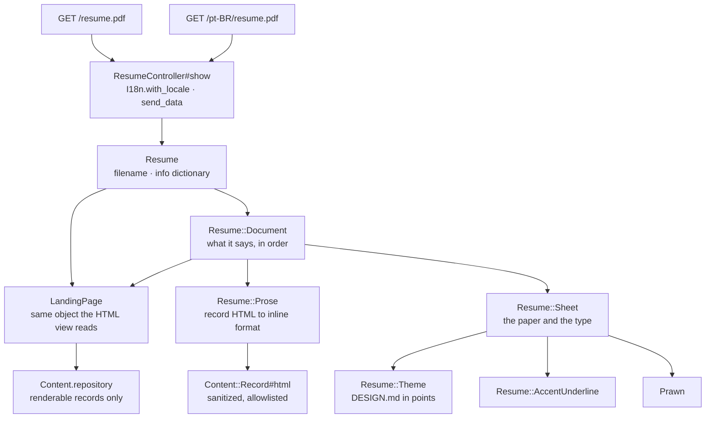

# Resume Download — implementation

- Updated: 2026-08-06
- Code as of: the working tree. **The `commit` field above is a placeholder** —
  this session was not permitted to run git, so it could not read `HEAD`. Fill
  it in with the SHA this doc is committed alongside.
- Spec: [SPEC.md](SPEC.md) · Visual language: [DESIGN.md](../../DESIGN.md)

Two PDFs, built on request from the records that render the page, and the gates
that make them safe to publish.

A page can be corrected. A downloaded file circulates uncorrected forever, so
the disclosure rules are applied twice: once to the words, and once to the
document information dictionary — the surface no reader looks at and every PDF
tool reads.

## Entry points / flow

There is no second content path. `LandingPage` owns which records appear, in
what order, and which of them were borrowed from the other locale; this feature
owns where they sit on a sheet of A4 and in which face. That is the SPEC's
accepted trade — the layout diverges from the page, and **only** the layout can,
because there is nowhere else for a fact to come from.

## Key files

| Path | Role |
|---|---|
| [app/models/resume.rb](../../app/models/resume.rb) | Both locale paths, the filename, and the document information dictionary. |
| [app/models/resume/theme.rb](../../app/models/resume/theme.rb) | [DESIGN.md](../../DESIGN.md) expressed in points: geometry, the ink ramp, the type scale, the rhythm, the hairlines. |
| [app/models/resume/sheet.rb](../../app/models/resume/sheet.rb) | The paper and the typographic vocabulary — rules, the gutter grid, widow guards, the notice box, the running footer. Knows Prawn; knows nothing about resumes. |
| [app/models/resume/document.rb](../../app/models/resume/document.rb) | What this document says and in what order — masthead, contact, the six sections, the colophon. Knows the records; touches Prawn only to escape a link label. |
| [app/models/resume/prose.rb](../../app/models/resume/prose.rb) | A record body's sanitized HTML converted to Prawn's inline format. |
| [app/models/resume/accent_underline.rb](../../app/models/resume/accent_underline.rb) | A per-fragment callback that underlines a link in the second ink. |
| [app/controllers/resume_controller.rb](../../app/controllers/resume_controller.rb) | One action, `send_data`, no `allow_browser`. See [Decisions](#decisions). |
| [config/routes.rb](../../config/routes.rb) | `resume.pdf` and `pt-BR/resume.pdf`, both `format: false`. |
| [app/models/landing_page.rb](../../app/models/landing_page.rb) | Gained `#updated`, moved off `Sitemap` on its second caller. |
| [app/models/sitemap.rb](../../app/models/sitemap.rb) | Now asks `LandingPage#updated` for `lastmod` instead of computing it. |
| [app/helpers/landing_helper.rb](../../app/helpers/landing_helper.rb), [app/views/landing/show.html.erb](../../app/views/landing/show.html.erb) | `resume_path_for`, and the download link in the contact block. |
| [config/locales/en.yml](../../config/locales/en.yml), [config/locales/pt-BR.yml](../../config/locales/pt-BR.yml) | Four new keys. Everything else the document says is borrowed from the page's own chrome. |
| [spec/support/pdf_text.rb](../../spec/support/pdf_text.rb) | Reads a generated PDF back the way everything downstream of a download does. |

New gems: `prawn` (runtime) and `pdf-reader` (test group only — the application
writes PDFs and never parses one).

## Configuration

None. No environment variable, no initializer, no writable path, no cache. The
document is built per request and exists only in the response body.

## Decisions

**Prawn on the fourteen base fonts, and nothing embedded.** The SPEC chose
Prawn; what fell out of it is that Helvetica and Courier cost zero font bytes,
which is the same budget [DESIGN.md](../../DESIGN.md) §3 declares for the page
and arrives at the same way. Verified: **zero `FontFile` entries** in either
document. Nothing about the machine that built the file travels with it.

The cost is the encoding. The base fonts cover WINDOWS-1252 and Prawn raises on
anything outside it, so a record carrying — say — a CJK name would fail. That
failure is deliberately loud and lands at build time: a spec renders both
locales over the real corpus, so an unrepresentable character fails `bin/ci`
rather than returning a 500 to somebody trying to download a resume.

**A4, not US Letter.** Letter is standard in one country; A4 is standard
everywhere else this document is read, including the two regions the profile
names alongside the US. The margins are wide enough that either sheet prints
without clipping.

**The document is the whole corpus, not a one-page selection.** The SPEC allows
exactly one thing to diverge from the page, and that is layout. Selecting a
"resume-appropriate" subset would have introduced a second editorial rule — what
appears — and that rule is precisely what drifts. So `/resume.pdf` is the page,
set for print: **8 pages** in English, **9** in Portuguese. It is a dossier
rather than a one-pager, and that is a consequence of the SPEC's own mitigation
rather than an oversight. Recorded as a limitation below.

**An indent, not a second bounding box.** This was a real bug, not a
preference. `Prawn::Document#cursor` measures against the current bounding box's
floor, and a *stretchy* box's floor is the cursor itself — so inside one,
`cursor` is permanently `0` and every widow guard fires. The first build came
out at **42 pages**. Prawn carries a margin box's padding onto each page it
generates, so `indent` gives the same two-column grid, keeps `cursor` meaningful,
and needs no page-break bookkeeping at all.

**The accent stays rationed.** [DESIGN.md](../../DESIGN.md) §2 spends the second
ink on states, and §5 sets a link as ink text with an accent underline. Prawn's
inline `<u>` strokes the underline in the fragment's own colour, so the parsed
fragments are post-processed and every link fragment carries
[a callback](../../app/models/resume/accent_underline.rb) that draws the hairline
itself — including the correct one when a link wraps. The one at-rest accent
instance is the segment on the masthead rule, which is the same move the share
card already makes.

**The contact block shows the addresses, not labels.** `linkedin.com/in/…`
rather than the word "LinkedIn". A hyperlink loses its own destination the moment
the file is printed, and this is a document that gets printed. Every entry is
still a live annotation — **8 across the English document**. The approved
`mauricio@zaffari.casa` alias appears as itself and is passed by the scanner's
allowlist, which is the allowlist doing its job rather than an exception.

**The information dictionary is set in full.** Prawn stamps `Creator` and
`Producer` with its own name; both are replaced by the canonical host. `Title`,
`Author` and `Subject` come out of the `site_profile` record. `Keywords` is
deliberately absent — it would be a second home for the skill records. The dates
are the corpus's own newest `updated`, at UTC midnight, not the clock: a clock
would stamp a different file on every download of unchanged content and disclose
the server's timezone for nothing. A consequence worth having is that the output
is **byte-identical for the same corpus**, which a spec asserts.

**Built per request, cached nowhere.** The container is stateless and has no
writable persistence, the corpus is a few dozen small files, and a cached
artifact is a second copy that goes stale — on a document that cannot be
withdrawn once fetched, that is the failure worth avoiding.

**No `allow_browser` on the controller.** The same defect
[site-metadata](../site-metadata/IMPLEMENTATION.md) found on `robots.txt`: the
gate reads the User-Agent, and a PDF has no rendering contract to protect. An
applicant tracking system fetching this file is not a browser, and a 406 is
indistinguishable from the document not existing. Verified from both sides — a
Chrome 49 UA gets 200 here, and putting the gate back fails the spec.

**The scan lives in a spec, not in a `bin/ci` step of its own.** `data/**` can be
swept by a rake task because it is a directory. This artifact does not exist
until the application has built it, which is exactly why the rendered-HTML scan
is also a spec. `bin/ci` runs the suite, so a leak still fails the build — it
fails at the step that can produce the bytes.

**`LandingPage#updated` moved off `Sitemap`.** Second caller, so it became a
method rather than staying duplicated. Both callers answer a nil the same way:
omit the field rather than publish a date that is not one.

**The drawing is split from the composition.** The first version was one
471-line class, two and a half times the largest model in the repository, and
the seam was obvious once it was written: one half knows Prawn and DESIGN.md,
the other knows record types. [Sheet](../../app/models/resume/sheet.rb) is the
paper and the vocabulary; [Document](../../app/models/resume/document.rb) is
what this particular document says. The split was verified byte-for-byte —
both PDFs are identical before and after it.

## Verified non-functionals

Measured, not asserted from theory.

**The documents.** English: **8 pages, 70,635 bytes**. Portuguese: **9 pages,
75,316 bytes** — the extra page is 34 substitution markers. Zero empty pages in
either. Every page was rendered to PNG and looked at: no overlapping text, no
clipped line, no stranded heading, the running footer present on all 17 pages,
and the gutter ordinals running 01 to 06.

**Fonts and annotations.** Four base fonts (`Helvetica`, `Helvetica-Bold`,
`Courier`, `Courier-Bold`), zero embedded font files, 8 link annotations.

**Determinism.** Two renders of the same corpus produce identical bytes.

**Headers.** `GET /resume.pdf` → 200 `application/pdf` with
`Content-Disposition: attachment` and the full hardened header set, including
`default-src 'none'`.

**Quality gate.** `bin/ci` exits 0: RuboCop (63 files), `herb analyze`,
`content:validate`, `content:scan`, `content:paths`, `importmap audit`, and
**278 RSpec examples** — up from 229.

**Both gates verified to fail.** Drawing a synthetic phone number into the
footer fails the text scan on both locales; putting an address into `Subject`
and `Prawn` into `Creator` fails the dictionary examples on both. Reverted after
each.

## Testing

| Spec | What it proves |
|---|---|
| [spec/requests/resume_spec.rb](../../spec/requests/resume_spec.rb) | Shared examples over both locales: 200 `application/pdf` starting `%PDF`; an `attachment` disposition carrying the stable filename; **the real bytes extracted and run through `Content::SafetyScanner` with zero findings**; the four allowlisted addresses present and no `tel:`; the information dictionary holding exactly seven keys, none of them a contact field, its readable values scanner-clean, its date fields matching a PDF date literal and nothing else, and naming no tool or version; no filesystem path, no `.afm`/`.ttf`, no `FontFile` in the raw bytes; the hardened headers; and a legacy User-Agent still getting the document. |
| `spec/requests/resume_spec.rb`, "the scan that guards it" | The failing fixture. `spec/fixtures/unsafe-record.md` — the same synthetic file that proves the scanner's rules still fire over `data/**` — is drawn into a PDF and read back, and **every one of the scanner's rules fires on the extracted text**. A scan that cannot fail is decoration; this is what makes the clean result above mean anything. |
| `spec/requests/resume_spec.rb`, "GET /pt-BR/resume.pdf" | The chrome is Portuguese, the notice appears once, and a `[EN]` marker appears on the borrowed entries — so a reader is told, rather than left to conclude the translation is broken. |
| [spec/models/resume_spec.rb](../../spec/models/resume_spec.rb) | Both paths come from the routing table; the filename is the record's `name` plus the locale's own noun; the dictionary's exact key set and record-derived values, with the generator's signature replaced and the dates taken from the corpus rather than the clock; both locales render; **every renderable record can be set in the fonts the document uses**; and the same corpus produces the same bytes. |
| `spec/models/resume_spec.rb`, "the records it draws from" | Against a throwaway corpus: every published record reaches the document, **a `draft` and a `restricted` record cannot**, and an approved link is shown as its own address. This is the SPEC's mitigation asserted directly — the facts are selected from records, not restated in a template. |
| [spec/support/pdf_text.rb](../../spec/support/pdf_text.rb) | Not a spec, but load-bearing. The scan runs over **two** extractions concatenated: `PDF::Reader::Page#text`, which rebuilds a character grid and silently merges lines set closer than the page's median font size, and the positioned drawing runs, which never merge but split at formatting boundaries. Each hides what the other shows, so a gate over one alone has a blind spot. |
| [spec/requests/landing_spec.rb](../../spec/requests/landing_spec.rb) | The contact-link assertion split in two: off-site destinations still have to match the allowlist exactly, and the same-origin set is now pinned to exactly one — the resume for the locale being served. A second internal link fails either way. |
| [spec/requests/rendered_html_safety_spec.rb](../../spec/requests/rendered_html_safety_spec.rb) | Unchanged. It is driven by the routing table, so it sees the two new routes and skips them on media type; their content is scanned above instead. |

## Known limitations / pitfalls

- **It is 8 pages, not one.** Deliberate, and explained under Decisions, but a
  recruiter expecting a one-page CV gets a dossier. If that becomes the wrong
  answer, the honest fix is a `prominence`-style key on the records — a
  selection rule the *corpus* owns — not a second list inside this feature.
- **The page is filled with `paper`.** DESIGN.md's only surface, and the same
  choice the share card makes, but it is a tint across a whole sheet: a reader
  who prints the file spends toner on it. `#FBF9F5` is close enough to white
  that most drivers barely register it. Recorded as a trade, not an oversight.
- **The PDF is untagged.** Prawn produces no structure tree and no `/Lang`, so
  assistive technology gets reading order from drawing order and no language
  hint — the page's `lang` attribute on a substituted container has no
  counterpart here. Drawing order *is* reading order, top to bottom, which is
  the mitigation rather than a fix. The accessible surface is the HTML page,
  which the download links back to in its colophon.
- **`/pt-BR/resume.pdf` is mostly English.** The Portuguese records do not exist
  yet, so the chrome is translated and the entries are borrowed and marked. Same
  fallback as the page; tracked in
  [curated-content](../curated-content/SPEC.md).
- **`bigdecimal` is pinned below 4.x.** Prawn depends on ttfunk, which requires
  `bigdecimal ~> 3.1`, so adding Prawn downgraded the lockfile's `bigdecimal`
  from 4.1.2 to 3.3.1. Nothing here uses `BigDecimal`, so it is inert — but it
  is a runtime dependency moved by a rendering choice, and worth knowing before
  something else asks for 4.x.
- **`Prawn::Fonts::AFM.hide_m17n_warning` is set.** Otherwise Prawn warns once
  per font per document about the encoding limit — in production logs, on every
  download. The decision it warns about has been made and is recorded above, and
  the limit is enforced by a spec instead of by a log line.
- **`pdf-reader`'s grid extraction merges tight lines.** The substitution
  notice's two lines sit 9.4pt apart at 7.5pt, closer than the page's median
  font size, and `Page#text` merges and reorders them. It is a text-extraction
  artifact, not a rendering fault — the PNGs show two correct lines — but it is
  the reason the specs read the positioned runs too, and the reason a future
  assertion about a sentence should use `pdf_flowed` rather than `pdf_text`.
- **The colophon points at the canonical origin, which is not live yet.** The
  document says where its current version lives; until
  [deployment](../deployment/SPEC.md) finishes, that URL does not answer.
