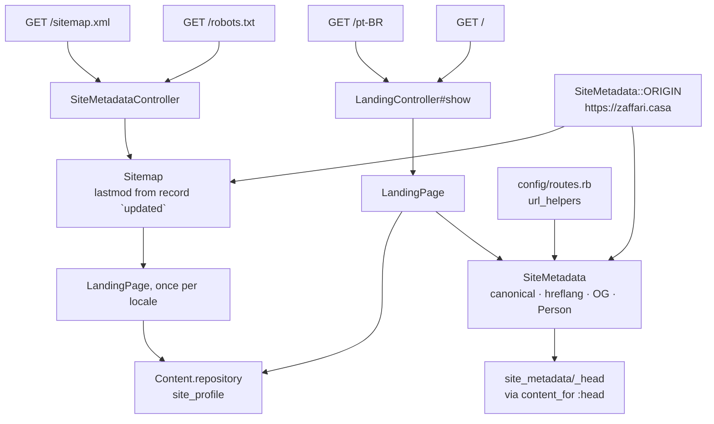

# Site Metadata — implementation

- Updated: 2026-08-08
- Code as of: repository commit `8d20fce`, the commit this feature landed in
- Spec: [SPEC.md](SPEC.md) · Visual language: [DESIGN.md](../../DESIGN.md)

Two `<head>` blocks, two crawler documents, and three PNGs. None of it is
visible in a browser window, which is the whole reason it needed specs: a
`telephone` added to the JSON-LD would survive every review that consists of
looking at the page.

Every value comes out of the `site_profile` record through the loader that
already serves the page. Nothing here restates content — this feature selects
from records and formats what it selected.

## Entry points / flow

`SiteMetadata::ORIGIN` and the routing table are the only two sources of a URL
in this feature. `LandingHelper#locale_path` now delegates to
`SiteMetadata.path_for`, so the language switcher, the canonical URL, the
`hreflang` set and the sitemap cannot disagree about where a locale lives.

## Key files

| Path | Role |
|---|---|
| [app/models/site_metadata.rb](../../app/models/site_metadata.rb) | The fixed origin, both locale URLs, the reciprocal alternates, the description, and the `Person` graph. |
| [app/models/sitemap.rb](../../app/models/sitemap.rb) | One entry per locale, each dated from the records that locale actually renders. |
| [app/controllers/site_metadata_controller.rb](../../app/controllers/site_metadata_controller.rb) | Two actions, no layout, explicit formats and content types. |
| [app/views/site_metadata/_head.html.erb](../../app/views/site_metadata/_head.html.erb) | Canonical, `hreflang`, Open Graph, Twitter, JSON-LD. Rendered into the layout's existing `yield :head`. |
| `app/views/site_metadata/robots.text.erb` | The crawler policy, and the paragraph explaining that it is one. |
| `app/views/site_metadata/sitemap.xml.erb` | `urlset` with `xhtml:link` alternate annotations. |
| [config/routes.rb](../../config/routes.rb) | `robots.txt` and `sitemap.xml`, both `format: false`. |
| [lib/tasks/site.rake](../../lib/tasks/site.rake) | `bin/rails site:images`. Build-time only; rebuilds `icon.png` and `og-image.png`. |
| `public/icon.svg`, `public/icon.png`, `public/og-image.png` | The mark and the share card. Committed artifacts. |
| [app/controllers/application_controller.rb](../../app/controllers/application_controller.rb), [app/controllers/landing_controller.rb](../../app/controllers/landing_controller.rb) | `allow_browser` moved from the base class to the page. See [Decisions](#decisions). |
| [config/locales/en.yml](../../config/locales/en.yml), [config/locales/pt-BR.yml](../../config/locales/pt-BR.yml) | One new key, `metadata.image_alt`. Chrome, translated, wrapped around record values. |

Deleted: `public/robots.txt`, the Rails generator's one-line stub. It sat in
front of the route — Rack's static file server answers before the router — so
leaving it there would have silently served an empty policy.

## Configuration

None. No environment variable, no initializer, no new gem. The origin is a
constant, deliberately.

## Decisions

**The canonical origin is a constant, not `request.base_url`.** A canonical URL
built from the request reflects whatever host answered — a staging name, a bare
IP, the proxy's internal hostname — and a canonical that varies by responder is
not a canonical. `SiteMetadata::ORIGIN` and `proxy.host` in
[config/deploy.yml](../../config/deploy.yml) are the only two places the origin
is written down, and they are changed together.

**AI and LLM crawlers are allowed, and `robots.txt` says so in prose.** This was
the SPEC's first open question. The site exists to be found, and a growing share
of the people it is written for will meet it through an assistant answering
someone else's question rather than through a browser. An assistant that cannot
read this page answers from something worse — a stale profile, a scraped
aggregator, a guess. The file therefore names GPTBot, ClaudeBot,
Google-Extended, PerplexityBot, CCBot and Applebot-Extended in a comment and
states that their coverage by the wildcard **is the policy**, because a decision
nobody wrote down is indistinguishable from an oversight six months later. A
spec asserts the comment is still there.

The only `Disallow` is `/up`, the container health check, which renders no
content and exists for the proxy.

**The share image is a static PNG, generated once by a committed script.** This
was the SPEC's second open question. What is actually installed here is
ImageMagick 6.9 with freetype and fontconfig; there is no libvips, and a Node or
headless-Chrome renderer is excluded from the runtime image by
[app-foundation](../app-foundation/SPEC.md) and
[deployment](../deployment/SPEC.md). Generating the card per request would have
added a dependency to the image to serve a file a scraper fetches once and
caches for months. So `bin/rails site:images` renders it at authoring time and
the PNG is committed. Verified deterministic: two consecutive runs produce
byte-identical files.

The card is DESIGN.md's own palette and two of the faces DESIGN.md already names
in its stacks (Noto Sans, DejaVu Sans Mono), so it matches what a Linux reader
sees rather than introducing a third face nobody chose. Warm paper, two
hairlines, a letter-spaced mono label, the name and headline from the record,
and one 120px accent segment sitting on the lower rule — the same at-rest
instance of the second ink that marks the current locale in the switcher. No
gradient, no shadow, no radius, consistent with [DESIGN.md](../../DESIGN.md) §7.

The task **aborts** if the name or the headline renders wider than the card's
measure. ImageMagick draws past the canvas edge without complaining, which would
ship a clipped name and no warning.

**The Rails generator icons were the site's icons, and they are gone.** Both
were a plain `#FF0000` circle — a colour that is not in the palette at all.
`public/icon.svg` is now a geometric two-ink mark: a paper field, an ink `Z`
drawn as a path rather than as a `<text>` element so it does not depend on a
font, and the accent rule beneath it. `icon.png` is rendered from that SVG by
the same rake task, so the two cannot drift. Checked at 16px and 32px by
downscaling and looking: the letterform holds and the accent rule survives as a
visible bar.

**JSON-LD is one `` hidden in a record value comes back escaped but intact**. |
| [spec/models/sitemap_spec.rb](../../spec/models/sitemap_spec.rb) | `lastmod` is the newest `updated` among renderable records, is not today's date, ignores a draft dated in the future, and dates a fallback locale from the records it actually shows. |
| [spec/requests/rendered_html_safety_spec.rb](../../spec/requests/rendered_html_safety_spec.rb) | Unchanged, and now sweeping the two new routes because it is driven by the routing table. It skips non-HTML responses, so `robots.txt` and `sitemap.xml` are scanned explicitly in the spec above instead. |
| [spec/requests/security_headers_spec.rb](../../spec/requests/security_headers_spec.rb), [spec/requests/landing_spec.rb](../../spec/requests/landing_spec.rb) | Two assertions narrowed, each with the reason recorded at the point of change: `<script>` is asserted by type rather than counted, and the subresource check now names the rels that actually fetch, because `canonical` and `alternate` must be absolute and cost no request. The coverage that moved is picked up by the document-wide origin allowlist above. |

## Known limitations / pitfalls

- **`bin/rails site:images` needs ImageMagick and two fonts that CI does not
  have.** It is an authoring tool, not a build step: nothing in `bin/ci` runs
  it, and the container has no ImageMagick at all. The consequence is that the
  PNGs can go stale — edit `site_profile`'s `name` or `headline` and the card
  still shows the old one until someone reruns the task. Nothing detects that
  today.
- **`ORIGIN` is duplicated in `config/deploy.yml`.** Two files, one value.
  `deploy.yml` cannot read a Ruby constant and the application should not parse
  a deploy file at boot, so the link is the comment on the constant. Change both.
- **`og:locale` says `en_US`.** The format has no way to spell "English, no
  territory in particular", and `en_US` is its own default. It is the one value
  in this feature that is not derived from anything.
- **The share card is a Linux rendering of the design.** DESIGN.md's font stacks
  are system stacks; the card is baked with Noto Sans and DejaVu Sans Mono, so a
  reader on macOS sees a card in slightly different faces from the page they
  click through to. Freezing one pair is the price of not shipping a web font.
- **The share card is English on both locales.** The description and the
  `Person` graph became Portuguese on `/pt-BR` when the pt-BR `site_profile`
  landed in `dfdab9f`, but `bin/rails site:images` renders `og-image.png` from
  `Content::Schema::DEFAULT_LOCALE` — one baked PNG serving both pages. A
  Portuguese card means a second file, a second `og:image` per locale, and a
  second thing to keep from going stale, which is not obviously worth it for an
  unfurl.
- **`lastmod` is a whole day.** `updated` is a date in the front matter, so two
  edits on one day are indistinguishable. That is the record schema's
  granularity, not this feature's, and a finer one would be invented precision.
- **Nothing validates the card against a real unfurler.** The SPEC asks for the
  card to be validated *by rendering it*, and the image itself was rendered and
  looked at — but LinkedIn's and Slack's scrapers cannot reach `localhost`, so
  the end-to-end unfurl is unproven until the site is deployed. Re-check it
  through each platform's own debugger after the first deploy.
- **`public/` is served by Rack before the router.** Dropping a `robots.txt` or
  a `sitemap.xml` back into `public/` silently shadows these routes and no spec
  fails, because the request spec would still see a 200.
